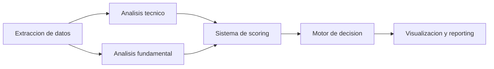

# [SISTEMA] Proyecto de Evaluación de Activos Financieros

## [OBJETIVO] Objetivo
Este proyecto tiene como objetivo evaluar activos financieros (acciones, ETFs, criptomonedas, etc.) de forma **agnóstica al mercado**, combinando **análisis técnico** y **análisis fundamental** en un sistema cuantitativo, explicable y modular.

El resultado final es un **score numérico**, una **clasificación discreta** (Strong Buy / Buy / Neutral / Sell / Strong Sell) y una **explicación detallada** del porqué de la decisión.

El proyecto está diseñado para:
- Uso experimental pero cercano a producción
- Apoyo personal a decisiones de inversión
- Aprendizaje profundo y portfolio profesional

---

## [FILOSOFIA] Filosofía del sistema

- Modular y extensible
- Explicable (no caja negra)
- Preparado para crecer (backtesting, ML, brokers)
- Visual y didáctico (notebooks)
- Separación clara entre datos, análisis, scoring y decisión

---

## [ARQUITECTURA] Arquitectura General

El sistema sigue un pipeline claro:

1. Extracción de datos
2. Análisis técnico
3. Análisis fundamental
4. Sistema de scoring
5. Motor de decisión
6. Visualización y reporting



Cada paso es independiente, testeable y reemplazable.

---

## [ESTRUCTURA] Estructura del repositorio

```
project/
│
├── src/
│   ├── data/                    [IMPLEMENTADO] Módulo de datos
│   │   ├── data.md              Documentación general del módulo
│   │   ├── raw/                 Extracción desde Yahoo Finance
│   │   │   ├── data_yahoo_finance.py
│   │   │   └── data.md          Documentación exhaustiva
│   │   └── cleaning/            [IMPLEMENTADO] Limpieza y preprocesamiento
│   │       ├── data_cleaner.py
│   │       └── cleaning.md       Documentación exhaustiva
│   │
│   ├── analisis/                [PENDIENTE] Módulo de análisis
│   │   ├── analisis.md          Documentación general del módulo
│   │   ├── fundamental/         Análisis fundamental
│   │   │   └── fundamental.md   Documentación exhaustiva
│   │   ├── technical/           Análisis técnico
│   │   │   └── technical.md     Documentación exhaustiva
│   │   └── scoring/             Sistema de scoring
│   │       └── scoring.md       Documentación exhaustiva
│   │
│   ├── final/                   [PENDIENTE] Módulo final
│   │   ├── final.md             Documentación general del módulo
│   │   ├── decision/            Motor de decisión
│   │   │   └── decision.md     Documentación exhaustiva
│   │   └── visualization/       Visualización y reporting
│   │       └── visualization.md Documentación exhaustiva
│   │
│   ├── config/                  [PENDIENTE] Configuración
│   └── utils/                   [PENDIENTE] Utilidades
│
├── data/
│   ├── raw/                     Cache de datos descargados
│   └── processed/               Datos procesados
│
├── notebooks/
│   ├── data_test.ipynb          Notebook de prueba del módulo data
│   └── data_cleaning_step_by_step.ipynb  Notebook de limpieza
│
├── tests/
│
├── venv/                        Entorno virtual Python
│
├── requirements.txt             Dependencias del proyecto
├── .gitignore
└── README.md
```

---

## [MODULOS] Estructura interna de cada módulo

Cada módulo contiene obligatoriamente:

- `module.py` → lógica principal
- `module.md` → explicación visual y conceptual
- `__init__.py` → exports del módulo
- `module_test.ipynb` → notebook de test (en carpeta notebooks/) con:
  - prints intermedios
  - tablas
  - visualizaciones
  - debugging

**Nota**: Los notebooks solo llaman funciones del módulo `src`, no contienen lógica de negocio.

**Documentación**: Cada carpeta principal en `src/` contiene un `.md` general, y cada subcarpeta contiene un `.md` exhaustivo con detalles completos del módulo.

---

## [ESTADO] Estado Actual del Proyecto

### [IMPLEMENTADO] Módulo Data

**Ubicación**: `src/data/`

#### Raw Data (`src/data/raw/`)
- Extracción de datos con yfinance
- Cache local con TTL configurable
- Reintentos automáticos con backoff exponencial
- Manejo robusto de errores y timeouts
- Funciones de visualización (tablas formateadas)
- Soporte para precios, fundamentales y estados financieros

**Características implementadas:**
- `DataProvider`: Clase principal para extracción de datos
- `get_price_data()`: Datos históricos OHLCV
- `get_fundamental_data()`: Métricas fundamentales
- `get_financial_statements()`: Estados financieros históricos
- `create_fundamental_tables()`: Tablas organizadas de datos fundamentales
- `create_historical_tables()`: Evolución histórica de métricas
- `format_number()`: Formateo de números grandes

#### Cleaning (`src/data/cleaning/`)
- Limpieza y preprocesamiento de datos financieros
- Validación de relaciones OHLC
- Manejo de valores nulos y duplicados
- Detección de outliers
- Añadir columnas auxiliares (returns, volatilidad, etc.)
- Metadata completa de transformaciones

**Características implementadas:**
- `DataCleaner`: Clase principal para limpieza
- `clean_price_data()`: Limpieza de datos OHLCV
- `clean_fundamental_data()`: Limpieza de datos fundamentales
- `clean_financial_statement()`: Limpieza de estados financieros
- `CleaningMetadata`: Trazabilidad de transformaciones

### [PENDIENTE] Módulos Restantes

#### Análisis (`src/analisis/`)
- **Technical**: Análisis técnico e indicadores
- **Fundamental**: Análisis fundamental y estrategias
- **Scoring**: Sistema de scoring unificado

#### Final (`src/final/`)
- **Decision**: Motor de decisión y clasificación
- **Visualization**: Visualización avanzada y reportes

#### Otros
- **Config** (`src/config/`): Sistema de configuración
- **Utils** (`src/utils/`): Utilidades compartidas

## [RESULTADOS] Resultados esperados

- Score numérico total
- Clasificación discreta
- Breakdown del score
- Tablas ejecutivas
- Gráficos interactivos
- Explicación textual legible

---

## [FUTURO] Futuro del proyecto

Arquitectura preparada para:
- Backtesting
- Optimización de parámetros
- Machine Learning
- Conexión con brokers reales
- Nuevas estrategias y mercados

---

## [INSTALACION] Instalación y Uso

### Requisitos

- Python 3.12+
- Entorno virtual (recomendado)

### Setup

```bash
# Crear entorno virtual
python -m venv venv

# Activar entorno virtual (Windows)
.\venv\Scripts\Activate.ps1

# Instalar dependencias
pip install -r requirements.txt
```

### Uso Básico

```python
from src.data import DataProvider, get_data
from src.data.cleaning import DataCleaner

# Obtener datos de un activo
provider = DataProvider()
data = provider.get_all_data("AAPL", period="1y")

# Limpiar datos
cleaner = DataCleaner()
cleaned_data, metadata = cleaner.clean_price_data(data['price_data'])

# O usar función de conveniencia
data = get_data("AAPL", period="1y")
```

Ver notebooks para ejemplos completos:
- `notebooks/data_test.ipynb` - Extracción de datos
- `notebooks/data_cleaning_step_by_step.ipynb` - Limpieza de datos

---

[AVISO] **Disclaimer**: Este proyecto no constituye asesoramiento financiero.
