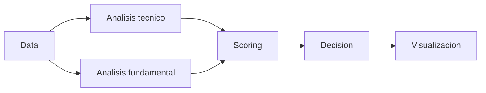

# Sistema de Evaluacion de Activos Financieros

## Objetivo
Evaluar activos financieros con analisis tecnico y fundamental para generar score, clasificacion y explicacion.

## Que hace
| Aspecto | Descripcion |
| --- | --- |
| Funcion | Pipeline de datos → analisis → scoring → decision → visualizacion |
| Salidas | Score, clasificacion, explicacion, tablas y graficos |
| Estado | Data implementado; analisis/scoring/final pendientes |

## Flujo

## Modulos
| Modulo | Ruta | Doc |
| --- | --- | --- |
| Datos | `src/data/` | `src/data/data.md` |
| Analisis | `src/analisis/` | `src/analisis/analisis.md` |
| Final | `src/final/` | `src/final/final.md` |
| Config | `src/config/` | `src/config/config.md` |
| Utils | `src/utils/` | `src/utils/utils.md` |

## Uso rapido
| Paso | Referencia |
| --- | --- |
| Extraccion de datos | `notebooks/data_test.ipynb` |
| Limpieza | `notebooks/data_cleaning_step_by_step.ipynb` |
| Indicadores | `notebooks/indicators_test.ipynb` |

## Notas
- Este proyecto no es asesoramiento financiero.
