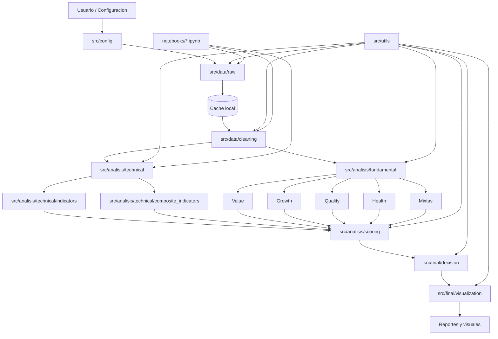

# Diagrama de Arquitectura

## Objetivo
Vista unica del pipeline y dependencias entre modulos.

## Flujo

```mermaid
flowchart TD
    User[Usuario / Configuracion] --> Config[src/config]
    Config --> DataRaw[src/data/raw]
    DataRaw --> Cache[(Cache local)]
    Cache --> DataClean[src/data/cleaning]

    DataClean --> Tech[src/analisis/technical]
    DataClean --> Fund[src/analisis/fundamental]

    Tech --> Indicators[src/analisis/technical/indicators]
    Tech --> Composite[src/analisis/technical/composite_indicators]

    Fund --> Value[Value]
    Fund --> Growth[Growth]
    Fund --> Quality[Quality]
    Fund --> Health[Health]
    Fund --> Mixed[Mixtas]

    Indicators --> Scoring[src/analisis/scoring]
    Composite --> Scoring
    Value --> Scoring
    Growth --> Scoring
    Quality --> Scoring
    Health --> Scoring
    Mixed --> Scoring

    Scoring --> Decision[src/final/decision]
    Decision --> Visualization[src/final/visualization]
    Visualization --> Reportes[Reportes y visuales]

    Utils[src/utils] --> DataRaw
    Utils --> DataClean
    Utils --> Tech
    Utils --> Fund
    Utils --> Scoring
    Utils --> Decision
    Utils --> Visualization

    Notebooks[notebooks/*.ipynb] --> DataRaw
    Notebooks --> DataClean
    Notebooks --> Tech
```

## Referencias
- Detalle por modulo: `README.md`
