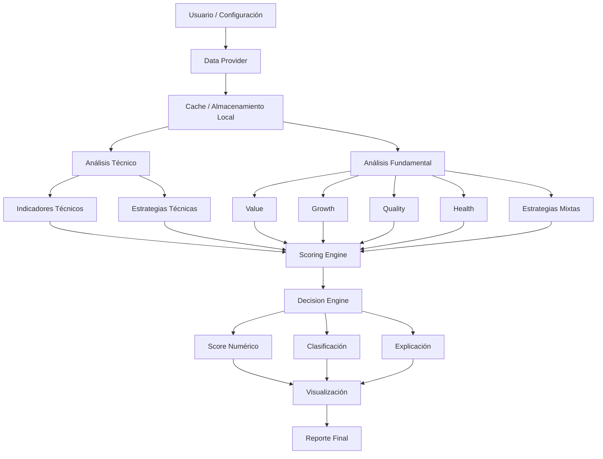

# [DIAGRAMA] Diagrama Conceptual del Sistema

---

## [DESCRIPCION] Descripción del flujo

- **Data Provider**: abstrae la fuente de datos (IMPLEMENTADO con yfinance)
- **Cache**: evita llamadas innecesarias (IMPLEMENTADO con TTL y reintentos)
- **Análisis Técnico/Fundamental**: generan señales (PENDIENTE)
- **Scoring Engine**: normaliza y pondera señales (PENDIENTE)
- **Decision Engine**: clasifica y explica (PENDIENTE)
- **Visualización**: gráficos y tablas ejecutivas (PARCIAL - tablas implementadas)

## [ESTADO] Estado de Implementación

- [COMPLETADO] Data Provider con cache y manejo de errores
- [COMPLETADO] Funciones de visualización básicas (tablas)
- [PENDIENTE] Análisis técnico
- [PENDIENTE] Análisis fundamental
- [PENDIENTE] Sistema de scoring
- [PENDIENTE] Motor de decisión
- [PENDIENTE] Visualización avanzada
