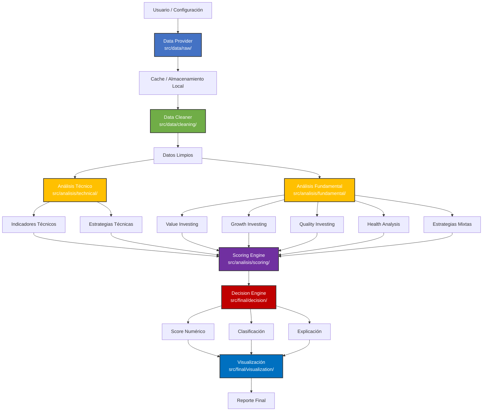

# [DIAGRAMA] Diagrama Conceptual del Sistema



---

## [DESCRIPCION] Descripción del flujo

### Fase 1: Datos (`src/data/`)
- **Data Provider** (`raw/`): abstrae la fuente de datos (IMPLEMENTADO con yfinance)
- **Cache**: evita llamadas innecesarias (IMPLEMENTADO con TTL y reintentos)
- **Data Cleaner** (`cleaning/`): limpia y preprocesa datos (IMPLEMENTADO)

### Fase 2: Análisis (`src/analisis/`)
- **Análisis Técnico** (`technical/`): genera señales técnicas (PENDIENTE)
- **Análisis Fundamental** (`fundamental/`): genera señales fundamentales (PENDIENTE)
- **Scoring Engine** (`scoring/`): normaliza y pondera señales (PENDIENTE)

### Fase 3: Final (`src/final/`)
- **Decision Engine** (`decision/`): clasifica y explica (PENDIENTE)
- **Visualización** (`visualization/`): gráficos y tablas ejecutivas (PARCIAL - tablas implementadas)

## [ESTADO] Estado de Implementación

### [COMPLETADO]
- Data Provider (`src/data/raw/`) con cache y manejo de errores
- Data Cleaner (`src/data/cleaning/`) para limpieza y preprocesamiento
- Funciones de visualización básicas (tablas)

### [PENDIENTE]
- Análisis técnico (`src/analisis/technical/`)
- Análisis fundamental (`src/analisis/fundamental/`)
- Sistema de scoring (`src/analisis/scoring/`)
- Motor de decisión (`src/final/decision/`)
- Visualización avanzada (`src/final/visualization/`)

## [ESTRUCTURA] Nueva Estructura del Proyecto

```
src/
├── data/           Datos (extracción y limpieza)
├── analisis/       Análisis (técnico, fundamental, scoring)
├── final/          Final (decisión, visualización)
├── config/         Configuración
└── utils/          Utilidades
```
