# 📐 Diagrama Conceptual del Sistema

```mermaid
flowchart TD

A[Usuario / Configuración] --> B[Data Provider]
B --> C[Cache / Almacenamiento Local]

C --> D[Análisis Técnico]
C --> E[Análisis Fundamental]

D --> D1[Indicadores Técnicos]
D --> D2[Estrategias Técnicas]

E --> E1[Value]
E --> E2[Growth]
E --> E3[Quality]
E --> E4[Health]
E --> E5[Estrategias Mixtas]

D1 --> F[Scoring Engine]
D2 --> F
E1 --> F
E2 --> F
E3 --> F
E4 --> F
E5 --> F

F --> G[Decision Engine]

G --> H1[Score Numérico]
G --> H2[Clasificación]
G --> H3[Explicación]

H1 --> I[Visualización]
H2 --> I
H3 --> I

I --> J[Reporte Final]
```

---

## 🔍 Descripción del flujo

- **Data Provider**: abstrae la fuente de datos
- **Cache**: evita llamadas innecesarias
- **Análisis Técnico/Fundamental**: generan señales
- **Scoring Engine**: normaliza y pondera señales
- **Decision Engine**: clasifica y explica
- **Visualización**: gráficos y tablas ejecutivas
