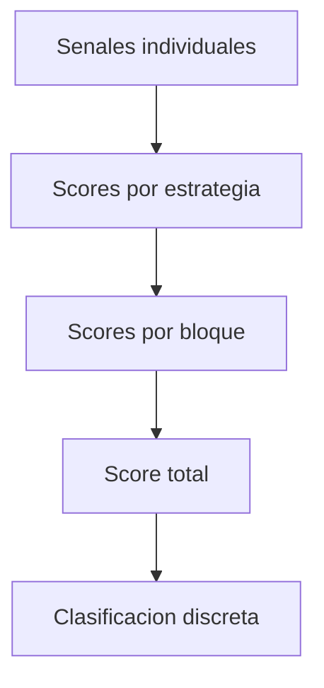

# [SCORING] Sistema de Scoring Propuesto

## [ESTADO] Estado Actual

**PENDIENTE DE IMPLEMENTACIÓN** - Este documento describe el diseño del sistema de scoring que se implementará.

## [OBJETIVO] Objetivo
Convertir múltiples señales heterogéneas en un **score unificado, normalizado y explicable**.



---

## 1. Nivel 1: Señales individuales

Cada indicador o métrica devuelve una señal normalizada:

| Tipo de señal | Rango |
|--------------|-------|
| Técnica      | -1 a +1 |
| Fundamental  | -1 a +1 |

Ejemplos:
- RSI < 30 → +1
- RSI > 70 → -1
- Crecimiento ingresos alto → +1
- Deuda excesiva → -1

---

## 2. Nivel 2: Scores por estrategia

Cada estrategia agrega señales relacionadas:

```
Score_estrategia = Σ(señal_i × peso_i)
```

Se normaliza a rango `[-1, +1]`.

Ejemplos:
- Estrategia técnica momentum
- Estrategia fundamental value
- Estrategia growth

---

## 3. Nivel 3: Scores por bloque

Se agrupan estrategias:

- Score Técnico
- Score Fundamental

Cada uno:
```
Score_bloque = Σ(score_estrategia × peso_estrategia)
```

---

## 4. Nivel 4: Score total

```
Score_total = w_técnico × Score_técnico + w_fundamental × Score_fundamental
```

Rango final normalizado `[-1, +1]` o `[-100, +100]`.

---

## 5. Clasificación discreta

| Score total | Clasificación |
|------------|---------------|
| > 0.6 | Strong Buy |
| 0.2 – 0.6 | Buy |
| -0.2 – 0.2 | Neutral |
| -0.6 – -0.2 | Sell |
| < -0.6 | Strong Sell |

---

## 6. Explicabilidad

El sistema debe guardar:
- Señales individuales
- Pesos
- Contribución al score final

Ejemplo de explicación:
> Buy porque:
> - RSI sobrevendido (+0.3)
> - Crecimiento ingresos fuerte (+0.4)
> - Deuda moderada (-0.1)

---

## [CONFIGURACION] Optimización futura

Pesos:
- Definidos inicialmente por teoría
- Configurables (YAML/JSON)
- Optimizables vía backtesting

---

## [VENTAJAS] Ventajas del sistema

- Modular
- Explicable
- Escalable
- Compatible con ML
- Fácil de debuggear
