# Sistema de Scoring

## Objetivo
Definir la agregacion de señales para obtener un score y clasificacion.

## Que hace
| Aspecto | Descripcion |
| --- | --- |
| Entradas | Señales normalizadas [-1, +1] |
| Proceso | Agregacion por estrategia y bloque |
| Salidas | Score total y clasificacion |

## Flujo

```mermaid
flowchart TD
    A[Señales] --> B[Estrategias]
    B --> C[Bloques]
    C --> D[Score total]
    D --> E[Clasificacion]
```

## Niveles
| Nivel | Descripcion |
| --- | --- |
| 1 | Señales individuales |
| 2 | Score por estrategia |
| 3 | Score por bloque |
| 4 | Score total |
| 5 | Clasificacion discreta |

## Clasificacion
| Rango score | Clase |
| --- | --- |
| > 0.6 | Strong Buy |
| 0.2 a 0.6 | Buy |
| -0.2 a 0.2 | Neutral |
| -0.6 a -0.2 | Sell |
| < -0.6 | Strong Sell |

## Referencias
- Implementacion prevista: `src/analisis/scoring/scoring.md`
