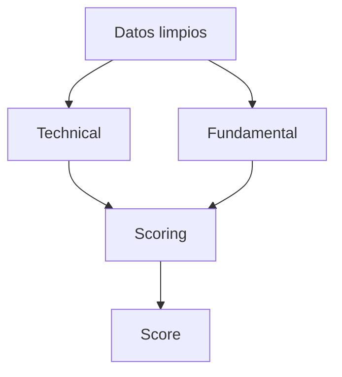

# Modulo de Analisis

## Objetivo
Convertir datos limpios en señales normalizadas para el scoring.

## Que hace
| Aspecto | Descripcion |
| --- | --- |
| Entradas | Datos OHLCV y fundamentales limpios |
| Salidas | Señales normalizadas por estrategia |
| Estado | Pendiente de implementacion |

## Componentes clave
- `technical/` analisis tecnico e indicadores
- `fundamental/` analisis fundamental
- `scoring/` agregacion y scoring

## Funciones clave (resumen)
| Modulo | Funcion |
| --- | --- |
| Tecnico | Calculo de indicadores |
| Fundamental | Calculo de señales por estrategia |
| Scoring | Agregacion y clasificacion |

## Flujo

## Referencias
- Tecnico: `src/analisis/technical/technical.md`
- Fundamental: `src/analisis/fundamental/fundamental.md`
- Scoring: `src/analisis/scoring/scoring.md`
- Diseño scoring: `scoring_system.md`
