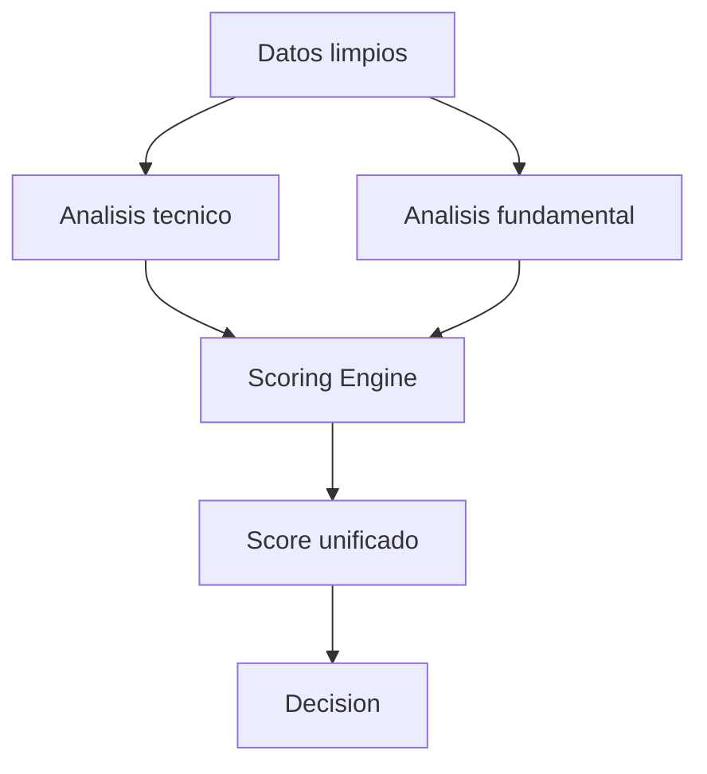

# [ANALISIS] Módulo de Análisis Financiero

## [OBJETIVO] Objetivo

Este módulo realiza análisis financiero sobre datos limpios para generar **señales normalizadas** que alimentan el sistema de scoring unificado.

El módulo `analisis` es el núcleo del sistema y transforma datos financieros en señales accionables.

## [ESTRUCTURA] Estructura del Módulo

```
src/analisis/
├── technical/      Análisis técnico e indicadores
│   └── technical.md   Documentación exhaustiva
├── fundamental/    Análisis fundamental y estrategias
│   └── fundamental.md   Documentación exhaustiva
└── scoring/        Sistema de scoring unificado
    └── scoring.md   Documentación exhaustiva
```

## [COMPONENTES] Componentes

### Technical (`src/analisis/technical/`)

Análisis técnico basado en precio y volumen.

**Funcionalidades**:
- Indicadores técnicos (RSI, MACD, Bollinger Bands, SMA, EMA, etc.)
- Estrategias técnicas (momentum, mean reversion, breakout, trend following)
- Señales normalizadas (-1 a +1) para cada estrategia
- Análisis multi-timeframe (opcional)

**Ver documentación completa**: `src/analisis/technical/technical.md`

### Fundamental (`src/analisis/fundamental/`)

Análisis fundamental basado en métricas financieras y estados financieros.

**Funcionalidades**:
- **Value investing**: Ratios de valoración (PE, PB, PS, EV/EBITDA)
- **Growth investing**: Métricas de crecimiento (revenue, earnings, EPS)
- **Quality investing**: Métricas de calidad (ROE, ROA, márgenes)
- **Health analysis**: Análisis de solvencia y liquidez
- **Estrategias mixtas**: Combinación de enfoques
- Señales normalizadas (-1 a +1) para cada estrategia

**Ver documentación completa**: `src/analisis/fundamental/fundamental.md`

### Scoring (`src/analisis/scoring/`)

Sistema de scoring unificado que combina señales técnicas y fundamentales.

**Funcionalidades**:
- Normalización de señales heterogéneas
- Agregación multi-nivel (señales → estrategias → bloques → total)
- Sistema de pesos configurable por estrategia y bloque
- Score unificado normalizado (-1 a +1)
- Breakdown detallado y explicabilidad completa
- Clasificación discreta (Strong Buy, Buy, Neutral, Sell, Strong Sell)

**Ver documentación completa**: `src/analisis/scoring/scoring.md`

## [FLUJO] Flujo de Datos



```
Datos Limpios (OHLCV + Fundamentales)
    ↓
┌─────────────────┬─────────────────┐
│ Technical       │ Fundamental      │
│ Analyzer        │ Analyzer         │
│                 │                  │
│ Señales:        │ Señales:         │
│ - momentum      │ - value          │
│ - mean_reversion│ - growth         │
│ - breakout      │ - quality        │
│ - trend         │ - health         │
└─────────────────┴─────────────────┘
    ↓
Scoring Engine
    ↓
Score Unificado + Breakdown
    ↓
Módulo Final (Decision)
```

## [NORMALIZACION] Normalización de Señales

Todas las señales se normalizan al rango **[-1, +1]**:

- **+1**: Señal muy positiva (compra fuerte)
- **0**: Neutral
- **-1**: Señal muy negativa (venta fuerte)

Esto permite:
- Comparabilidad entre estrategias diferentes
- Agregación sencilla en el scoring
- Interpretación intuitiva

## [ESTADO] Estado

- ⏳ [PENDIENTE] Análisis técnico (`technical/`)
- ⏳ [PENDIENTE] Análisis fundamental (`fundamental/`)
- ⏳ [PENDIENTE] Sistema de scoring (`scoring/`)

## [DOCUMENTACION] Documentación Detallada

Para información exhaustiva sobre cada componente:

- **Análisis técnico**: Ver `src/analisis/technical/technical.md`
- **Análisis fundamental**: Ver `src/analisis/fundamental/fundamental.md`
- **Sistema de scoring**: Ver `src/analisis/scoring/scoring.md`
- **Diseño del sistema**: Ver `scoring_system.md` en la raíz del proyecto
