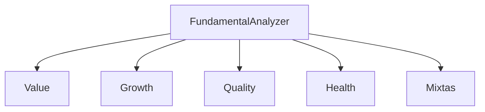

# Modulo de Analisis Fundamental

## Objetivo
Evaluar valor, crecimiento, calidad y salud financiera para generar señales.

## Que hace
| Aspecto | Descripcion |
| --- | --- |
| Entradas | Fundamentales + estados financieros |
| Salidas | Señales normalizadas por estrategia |
| Estado | Pendiente de implementacion |

## Estrategias
| Grupo | Enfoque |
| --- | --- |
| Value | Valoracion (PE, PB, PS, EV/EBITDA) |
| Growth | Crecimiento ingresos/ganancias |
| Quality | Rentabilidad y margenes |
| Health | Deuda y liquidez |
| Mixtas | Combinaciones Value/Growth/Quality |

## Funciones clave (planificado)
| Funcion | Descripcion |
| --- | --- |
| Value | Señales de valoracion |
| Growth | Señales de crecimiento |
| Quality | Señales de calidad |
| Health | Señales de salud financiera |
| Mixtas | Señales combinadas |

## Flujo

## Inputs / Outputs
| Tipo | Descripcion |
| --- | --- |
| Inputs | Dict de metricas, estados financieros |
| Outputs | Señales en [-1, +1] |
