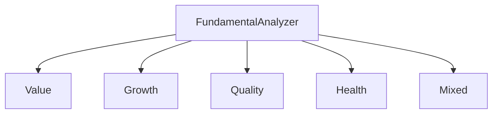

# [FUNDAMENTAL] Módulo de Análisis Fundamental

## [UBICACION] Ubicación

`src/analisis/fundamental/`

## [OBJETIVO] Objetivo

Este módulo implementa **análisis fundamental** basado en métricas financieras, ratios y estados financieros para generar señales normalizadas que alimentan el sistema de scoring.

El análisis fundamental evalúa el valor intrínseco de una empresa basándose en:
- Estados financieros
- Métricas de rentabilidad
- Ratios de valoración
- Salud financiera
- Perspectivas de crecimiento

---

## [ESTADO] Estado Actual

Módulo en desarrollo inicial. Pendiente de implementación.

---

## [ARQUITECTURA] Arquitectura del Módulo



```
FundamentalAnalyzer
├── Value Investing
│   ├── PE Ratio Analysis
│   ├── PB Ratio Analysis
│   ├── PS Ratio Analysis
│   └── EV/EBITDA Analysis
├── Growth Investing
│   ├── Revenue Growth
│   ├── Earnings Growth
│   ├── EPS Growth
│   └── Book Value Growth
├── Quality Investing
│   ├── ROE Analysis
│   ├── ROA Analysis
│   ├── Margin Analysis
│   └── Efficiency Ratios
├── Health Analysis
│   ├── Debt Analysis
│   ├── Liquidity Analysis
│   ├── Solvency Ratios
│   └── Cash Flow Analysis
└── Mixed Strategies
    ├── Value + Quality
    ├── Growth + Quality
    └── Value + Growth + Quality
```

---

## [FUNCIONALIDADES] Funcionalidades Planificadas

### Value Investing

Evalúa si una acción está **subvalorada** o **sobrevalorada** comparando su precio con métricas fundamentales.

#### Ratios de Valoración

- **PE Ratio (Price-to-Earnings)**: Precio / Ganancias por acción
  - PE bajo: Posiblemente subvalorada
  - PE alto: Posiblemente sobrevalorada
  - Comparación con sector e histórico

- **PB Ratio (Price-to-Book)**: Precio / Valor en libros
  - PB < 1: Posiblemente subvalorada
  - Comparación con sector

- **PS Ratio (Price-to-Sales)**: Precio / Ventas por acción
  - Útil para empresas sin ganancias
  - Comparación con sector

- **EV/EBITDA**: Enterprise Value / EBITDA
  - Normaliza diferencias en estructura de capital
  - Comparación con sector

#### Señales Normalizadas

- **+1**: Muy subvalorada (excelente oportunidad de compra)
- **0**: Valoración justa
- **-1**: Muy sobrevalorada (evitar o vender)

### Growth Investing

Evalúa el **potencial de crecimiento** de una empresa basándose en métricas históricas y proyectadas.

#### Métricas de Crecimiento

- **Revenue Growth**: Crecimiento de ingresos (anual, trimestral)
- **Earnings Growth**: Crecimiento de ganancias
- **EPS Growth**: Crecimiento de ganancias por acción
- **Book Value Growth**: Crecimiento del valor en libros
- **Free Cash Flow Growth**: Crecimiento del flujo de caja libre

#### Análisis de Tendencias

- Tendencias aceleradas vs desaceleradas
- Consistencia del crecimiento
- Comparación con sector

#### Señales Normalizadas

- **+1**: Crecimiento muy fuerte y sostenible
- **0**: Crecimiento moderado o estancado
- **-1**: Crecimiento negativo o en declive

### Quality Investing

Evalúa la **calidad** de una empresa basándose en rentabilidad, eficiencia y sostenibilidad.

#### Métricas de Rentabilidad

- **ROE (Return on Equity)**: Ganancias / Equity
  - ROE alto: Uso eficiente del capital
  - Comparación con sector e histórico

- **ROA (Return on Assets)**: Ganancias / Activos
  - Eficiencia en uso de activos

- **ROIC (Return on Invested Capital)**: Ganancias / Capital invertido
  - Eficiencia del capital invertido

#### Análisis de Márgenes

- **Gross Margin**: Margen bruto
- **Operating Margin**: Margen operativo
- **Net Margin**: Margen neto
- **Tendencias**: Mejora o deterioro de márgenes

#### Eficiencia Operativa

- **Asset Turnover**: Ventas / Activos
- **Inventory Turnover**: Ventas / Inventario
- **Receivables Turnover**: Ventas / Cuentas por cobrar

#### Señales Normalizadas

- **+1**: Excelente calidad (alta rentabilidad, márgenes fuertes)
- **0**: Calidad promedio
- **-1**: Baja calidad (baja rentabilidad, márgenes débiles)

### Health Analysis

Evalúa la **salud financiera** y **solvencia** de una empresa.

#### Análisis de Deuda

- **Debt-to-Equity**: Deuda / Equity
- **Debt-to-Assets**: Deuda / Activos
- **Interest Coverage**: EBITDA / Intereses
- **Comparación**: Con sector e histórico

#### Análisis de Liquidez

- **Current Ratio**: Activos corrientes / Pasivos corrientes
- **Quick Ratio**: (Activos corrientes - Inventario) / Pasivos corrientes
- **Cash Ratio**: Efectivo / Pasivos corrientes

#### Análisis de Flujo de Efectivo

- **Free Cash Flow**: Flujo operativo - CapEx
- **FCF Yield**: Free Cash Flow / Market Cap
- **Consistencia**: Flujos positivos y crecientes

#### Señales Normalizadas

- **+1**: Excelente salud financiera (baja deuda, alta liquidez)
- **0**: Salud financiera promedio
- **-1**: Salud financiera débil (alta deuda, baja liquidez)

### Estrategias Mixtas

Combina múltiples enfoques para análisis más completo:

#### Value + Quality

- Busca empresas subvaloradas con alta calidad
- Evita "value traps" (baratas pero de mala calidad)

#### Growth + Quality

- Busca empresas con crecimiento sostenible y alta calidad
- Evita crecimiento insostenible

#### Value + Growth + Quality

- Enfoque balanceado considerando los tres factores
- Ponderación configurable

---

## [USO] Uso Previsto

### Inicialización

```python
from src.analisis.fundamental import FundamentalAnalyzer

# Crear analizador fundamental
analyzer = FundamentalAnalyzer(
    fundamental_data=fundamental_dict,
    income_statement=income_df,
    balance_sheet=balance_df,
    cashflow_statement=cashflow_df
)
```

### Análisis por Estrategia

```python
# Value investing
value_signal = analyzer.value_investing_strategy()

# Growth investing
growth_signal = analyzer.growth_investing_strategy()

# Quality investing
quality_signal = analyzer.quality_investing_strategy()

# Health analysis
health_signal = analyzer.health_analysis_strategy()
```

### Estrategias Mixtas

```python
# Value + Quality
value_quality_signal = analyzer.mixed_strategy(
    strategies=['value', 'quality'],
    weights=[0.6, 0.4]
)

# Todas las estrategias
all_signals = analyzer.get_all_signals()
```

### Obtener Señales Normalizadas

```python
# Todas las señales normalizadas (-1 a +1)
signals = analyzer.get_all_signals()

# Retorna diccionario:
# {
#     'value': 0.80,
#     'growth': 0.60,
#     'quality': 0.70,
#     'health': 0.50,
#     'value_quality': 0.75,
#     'growth_quality': 0.65
# }
```

---

## [NORMALIZACION] Normalización de Señales

Todas las señales se normalizan al rango **[-1, +1]**:

- **+1**: Señal muy positiva (excelente oportunidad)
- **0**: Neutral
- **-1**: Señal muy negativa (evitar)

### Métodos de Normalización

- **Comparación con sector**: Percentiles relativos al sector
- **Comparación histórica**: Tendencia vs histórico de la empresa
- **Umbrales absolutos**: Valores absolutos para ratios conocidos
- **Combinación**: Mezcla de métodos según disponibilidad de datos

---

## [INTEGRACION] Integración con Otros Módulos

### Entrada

- **Datos fundamentales**: Dict con métricas del módulo `data/raw`
- **Estados financieros**: DataFrames de income, balance, cashflow
- **Requisitos**:
  - Datos limpios y normalizados
  - Comparables con datos de sector (opcional)

### Salida

- **Señales normalizadas**: Diccionario con señales de cada estrategia
- **Formato**: `{'strategy_name': signal_value}` donde `signal_value` ∈ [-1, +1]

### Flujo

```
Datos Fundamentales + Estados Financieros
    ↓
FundamentalAnalyzer
    ↓
Señales Normalizadas
    ↓
Scoring Engine
```

---

## [RATIOS] Ratios Clave Implementados

### Valoración

- PE Ratio (Trailing, Forward)
- PB Ratio
- PS Ratio
- EV/EBITDA
- PEG Ratio (PE / Growth)

### Rentabilidad

- ROE (Return on Equity)
- ROA (Return on Assets)
- ROIC (Return on Invested Capital)
- Gross Margin
- Operating Margin
- Net Margin

### Crecimiento

- Revenue Growth (YoY, QoQ)
- Earnings Growth (YoY, QoQ)
- EPS Growth (YoY, QoQ)
- Book Value Growth

### Salud Financiera

- Debt-to-Equity
- Debt-to-Assets
- Current Ratio
- Quick Ratio
- Interest Coverage
- Free Cash Flow Yield

---

## [COMPARACION] Comparación con Benchmarks

### Comparación con Sector

- Percentiles relativos al sector
- Identificación de outliers positivos/negativos
- Normalización basada en posición relativa

### Comparación Histórica

- Tendencias de la empresa
- Mejora o deterioro en el tiempo
- Consistencia de métricas

### Comparación con Mercado

- Comparación con índices (S&P 500, sector)
- Identificación de oportunidades relativas

---

## [CONFIGURACION] Parámetros Configurables

### Pesos de Estrategias Mixtas

```python
analyzer = FundamentalAnalyzer(
    value_weight=0.3,
    growth_weight=0.3,
    quality_weight=0.2,
    health_weight=0.2
)
```

### Umbrales de Normalización

```python
analyzer = FundamentalAnalyzer(
    pe_threshold_low=10,      # PE bajo = señal positiva
    pe_threshold_high=30,     # PE alto = señal negativa
    roe_threshold=0.15,        # ROE mínimo para calidad
    debt_threshold=0.5         # Debt/Equity máximo para salud
)
```

---

## [VALIDACION] Validación y Testing

### Validación de Ratios

- Verificación de fórmulas con datos conocidos
- Comparación con calculadoras financieras estándar
- Validación de rangos razonables

### Validación de Señales

- Señales deben estar en rango [-1, +1]
- Consistencia entre estrategias relacionadas
- Testing con empresas conocidas (ej: AAPL, MSFT)

---

## [LIMITACIONES] Limitaciones Conocidas

- Requiere **datos fundamentales completos** y actualizados
- Comparación con sector requiere **datos de sector** (no siempre disponibles)
- Métricas pueden estar **desactualizadas** (reportes trimestrales)
- No considera **eventos futuros** o **catalizadores**
- Puede pasar por alto **cambios en el modelo de negocio**

---

## [FUTURO] Mejoras Futuras

- Integración con datos de estimaciones (analyst estimates)
- Análisis de calidad de ganancias (earnings quality)
- Detección de red flags financieros
- Análisis de management (governance scores)
- Comparación automática con sector usando APIs
- Análisis de sostenibilidad (ESG scores)
- Machine learning para optimización de pesos
- Análisis de segmentos de negocio
