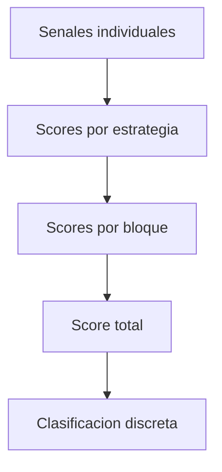

# [SCORING] Módulo de Sistema de Scoring Unificado

## [UBICACION] Ubicación

`src/analisis/scoring/`

## [OBJETIVO] Objetivo

Este módulo combina señales heterogéneas de análisis técnico y fundamental en un **score unificado y normalizado** que alimenta el motor de decisión.

El sistema de scoring:
- Normaliza señales de diferentes fuentes
- Agrega señales en múltiples niveles
- Aplica pesos configurables
- Genera breakdown detallado
- Proporciona explicabilidad completa

---

## [ESTADO] Estado Actual

Módulo en desarrollo inicial. Pendiente de implementación.

---

## [ARQUITECTURA] Arquitectura del Sistema

Ver `scoring_system.md` en la raíz del proyecto para detalles completos del diseño.

### Niveles de Agregación



```
Nivel 1: Señales Individuales
    ↓
Nivel 2: Scores por Estrategia
    ↓
Nivel 3: Scores por Bloque (Técnico/Fundamental)
    ↓
Nivel 4: Score Total
    ↓
Nivel 5: Clasificación Discreta
```

### Estructura Detallada

```
Score Total
├── Bloque Técnico (peso: 0.4)
│   ├── Momentum Strategy (peso: 0.3)
│   │   ├── RSI Signal
│   │   ├── MACD Signal
│   │   └── Stochastic Signal
│   ├── Mean Reversion Strategy (peso: 0.2)
│   │   ├── Bollinger Bands Signal
│   │   └── RSI Extreme Signal
│   ├── Breakout Strategy (peso: 0.25)
│   │   └── Volume + Volatility Signal
│   └── Trend Following Strategy (peso: 0.25)
│       ├── Moving Average Crossover
│       └── MACD Trend Signal
│
└── Bloque Fundamental (peso: 0.6)
    ├── Value Investing (peso: 0.3)
    │   ├── PE Ratio Signal
    │   ├── PB Ratio Signal
    │   └── EV/EBITDA Signal
    ├── Growth Investing (peso: 0.25)
    │   ├── Revenue Growth Signal
    │   └── Earnings Growth Signal
    ├── Quality Investing (peso: 0.25)
    │   ├── ROE Signal
    │   ├── Margin Signal
    │   └── Efficiency Signal
    └── Health Analysis (peso: 0.2)
        ├── Debt Signal
        ├── Liquidity Signal
        └── Cash Flow Signal
```

---

## [FUNCIONALIDADES] Funcionalidades Planificadas

### Normalización de Señales

Todas las señales de entrada ya están normalizadas a [-1, +1] por los módulos de análisis, pero el scoring puede aplicar transformaciones adicionales:

- **Escalado**: Ajuste de rango si es necesario
- **Suavizado**: Reducción de ruido
- **Validación**: Verificación de rangos válidos

### Agregación Multi-Nivel

#### Nivel 1: Señales Individuales

Señales básicas de indicadores individuales:
- RSI Signal: -1 a +1
- MACD Signal: -1 a +1
- PE Ratio Signal: -1 a +1
- etc.

#### Nivel 2: Scores por Estrategia

Agregación de señales relacionadas en estrategias:

```python
momentum_score = weighted_average([
    rsi_signal,
    macd_signal,
    stochastic_signal
], weights=[0.4, 0.4, 0.2])
```

#### Nivel 3: Scores por Bloque

Agregación de estrategias en bloques principales:

```python
technical_score = weighted_average([
    momentum_score,
    mean_reversion_score,
    breakout_score,
    trend_following_score
], weights=[0.3, 0.2, 0.25, 0.25])

fundamental_score = weighted_average([
    value_score,
    growth_score,
    quality_score,
    health_score
], weights=[0.3, 0.25, 0.25, 0.2])
```

#### Nivel 4: Score Total

Agregación final de bloques:

```python
total_score = weighted_average([
    technical_score,
    fundamental_score
], weights=[0.4, 0.6])
```

#### Nivel 5: Clasificación Discreta

Conversión de score continuo a clasificación:

- **Strong Buy**: Score > 0.6
- **Buy**: Score 0.2 - 0.6
- **Neutral**: Score -0.2 - 0.2
- **Sell**: Score -0.6 - -0.2
- **Strong Sell**: Score < -0.6

### Sistema de Pesos Configurable

Los pesos son completamente configurables:

```python
scorer = ScoringEngine(
    technical_weight=0.4,
    fundamental_weight=0.6,
    strategy_weights={
        'momentum': 0.3,
        'mean_reversion': 0.2,
        'breakout': 0.25,
        'trend_following': 0.25,
        'value': 0.3,
        'growth': 0.25,
        'quality': 0.25,
        'health': 0.2
    }
)
```

### Breakdown Detallado

El sistema genera un breakdown completo que muestra:

- Score total
- Contribución de cada bloque
- Contribución de cada estrategia
- Contribución de cada señal individual
- Explicación textual de cada nivel

---

## [USO] Uso Previsto

### Inicialización

```python
from src.analisis.scoring import ScoringEngine

# Con pesos por defecto
scorer = ScoringEngine()

# Con pesos personalizados
scorer = ScoringEngine(
    technical_weight=0.5,
    fundamental_weight=0.5
)
```

### Calcular Score

```python
# Señales de análisis técnico
technical_signals = {
    'momentum': 0.75,
    'mean_reversion': -0.30,
    'breakout': 0.50,
    'trend_following': 0.60
}

# Señales de análisis fundamental
fundamental_signals = {
    'value': 0.80,
    'growth': 0.60,
    'quality': 0.70,
    'health': 0.50
}

# Calcular score total
result = scorer.calculate_score(
    technical_signals=technical_signals,
    fundamental_signals=fundamental_signals
)

# Result contiene:
# - total_score: 0.65
# - classification: "Buy"
# - breakdown: Diccionario completo con todos los niveles
# - explanation: Texto explicativo
```

### Obtener Breakdown

```python
breakdown = result['breakdown']

# Estructura del breakdown:
# {
#     'total': 0.65,
#     'technical': {
#         'score': 0.55,
#         'weight': 0.4,
#         'contribution': 0.22,
#         'strategies': {
#             'momentum': {'score': 0.75, 'weight': 0.3, 'contribution': 0.225},
#             ...
#         }
#     },
#     'fundamental': {
#         'score': 0.70,
#         'weight': 0.6,
#         'contribution': 0.42,
#         'strategies': {
#             'value': {'score': 0.80, 'weight': 0.3, 'contribution': 0.24},
#             ...
#         }
#     }
# }
```

### Obtener Explicación

```python
explanation = result['explanation']

# Texto legible explicando:
# - Por qué el score es positivo/negativo
# - Qué estrategias contribuyen más
# - Qué señales son más fuertes
# - Recomendación general
```

---

## [ALGORITMOS] Algoritmos de Agregación

### Media Ponderada

Método principal de agregación:

```python
def weighted_average(signals, weights):
    """
    Calcula media ponderada de señales normalizadas.
    
    Args:
        signals: Lista de valores en [-1, +1]
        weights: Lista de pesos (deben sumar 1.0)
    
    Returns:
        Score normalizado en [-1, +1]
    """
    assert len(signals) == len(weights)
    assert abs(sum(weights) - 1.0) < 1e-6
    
    return sum(s * w for s, w in zip(signals, weights))
```

### Normalización de Pesos

Los pesos se normalizan automáticamente si no suman 1.0:

```python
def normalize_weights(weights):
    """Normaliza pesos para que sumen 1.0."""
    total = sum(weights)
    return [w / total for w in weights]
```

### Validación de Señales

Todas las señales se validan antes de agregar:

```python
def validate_signal(signal):
    """Valida que señal esté en rango [-1, +1]."""
    if signal < -1 or signal > 1:
        raise ValueError(f"Signal {signal} fuera de rango [-1, +1]")
    return signal
```

---

## [CONFIGURACION] Configuración Avanzada

### Perfiles de Pesos Predefinidos

```python
# Perfil conservador (más peso a fundamental)
scorer = ScoringEngine(profile='conservative')

# Perfil agresivo (más peso a técnico)
scorer = ScoringEngine(profile='aggressive')

# Perfil balanceado (pesos iguales)
scorer = ScoringEngine(profile='balanced')
```

### Pesos Personalizados por Estrategia

```python
scorer = ScoringEngine(
    strategy_weights={
        'momentum': 0.4,          # Más peso a momentum
        'mean_reversion': 0.1,    # Menos peso a mean reversion
        'value': 0.4,             # Más peso a value
        'growth': 0.2             # Menos peso a growth
    }
)
```

### Umbrales de Clasificación Personalizados

```python
scorer = ScoringEngine(
    classification_thresholds={
        'strong_buy': 0.7,    # Más estricto
        'buy': 0.3,
        'neutral': 0.0,
        'sell': -0.3,
        'strong_sell': -0.7
    }
)
```

---

## [EXPLICABILIDAD] Explicabilidad y Transparencia

### Breakdown Detallado

Cada nivel de agregación es trazable:

- **Señal → Estrategia**: Cómo cada señal contribuye a su estrategia
- **Estrategia → Bloque**: Cómo cada estrategia contribuye a su bloque
- **Bloque → Total**: Cómo cada bloque contribuye al score total

### Explicación Textual

El sistema genera explicaciones legibles:

```
"Score Total: 0.65 (Buy)

El análisis muestra una señal positiva principalmente debido a:

Bloque Fundamental (contribución: 0.42):
- Value Investing muestra señal muy positiva (0.80)
- Quality Investing muestra señal positiva (0.70)
- Growth Investing muestra señal moderada (0.60)

Bloque Técnico (contribución: 0.22):
- Momentum Strategy muestra señal positiva (0.75)
- Trend Following muestra señal positiva (0.60)

Recomendación: Compra moderada basada en fuerte valoración y calidad,
con momentum técnico positivo."
```

---

## [INTEGRACION] Integración con Otros Módulos

### Entrada

- **Señales técnicas**: Del módulo `analisis/technical`
- **Señales fundamentales**: Del módulo `analisis/fundamental`
- **Formato**: Diccionarios con señales normalizadas [-1, +1]

### Salida

- **Score total**: Valor en [-1, +1]
- **Clasificación**: String discreto (Strong Buy, Buy, etc.)
- **Breakdown**: Estructura completa de agregación
- **Explicación**: Texto legible

### Flujo

```
Technical Signals + Fundamental Signals
    ↓
ScoringEngine
    ↓
Score Total + Classification + Breakdown
    ↓
Decision Engine
```

---

## [VALIDACION] Validación y Testing

### Validación de Pesos

- Pesos deben sumar 1.0 (o se normalizan)
- Pesos deben ser positivos
- Validación de estructura de señales

### Validación de Scores

- Score total debe estar en [-1, +1]
- Breakdown debe ser consistente
- Contribuciones deben sumar al score total

### Testing

- Testing con señales conocidas
- Verificación de agregación correcta
- Validación de explicaciones generadas

---

## [LIMITACIONES] Limitaciones Conocidas

- **Dependencia de señales de entrada**: Calidad del score depende de calidad de señales
- **Pesos subjetivos**: Requieren calibración y validación
- **No considera correlaciones**: Señales pueden estar correlacionadas
- **No adaptativo**: Pesos fijos, no se ajustan automáticamente

---

## [FUTURO] Mejoras Futuras

- **Pesos adaptativos**: Ajuste automático basado en condiciones de mercado
- **Machine learning**: Optimización de pesos con datos históricos
- **Análisis de sensibilidad**: Cómo cambia el score con cambios en pesos
- **Backtesting**: Validación histórica del sistema de scoring
- **Múltiples perfiles**: Perfiles específicos por sector o tipo de activo
- **Integración con sentimiento**: Incorporar señales de sentimiento de mercado
- **Análisis de riesgo**: Incorporar métricas de riesgo en el score
