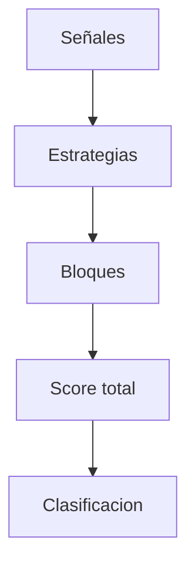

# Modulo de Scoring

## Objetivo
Agregar señales tecnicas y fundamentales en un score unico.

## Que hace
| Aspecto | Descripcion |
| --- | --- |
| Entradas | Señales normalizadas por estrategia |
| Salidas | Score total, clasificacion, breakdown |
| Estado | Pendiente de implementacion |

## Flujo

## Componentes clave
- Normalizacion y validacion de señales
- Agregacion por estrategia y bloque
- Pesos configurables

## Funciones clave (planificado)
| Funcion | Descripcion |
| --- | --- |
| Normalizar señales | Validar rango [-1, +1] |
| Agregar estrategias | Score por estrategia |
| Agregar bloques | Score tecnico/fundamental |
| Clasificar | Mapear score a clase |

## Referencias
- Diseño completo: `scoring_system.md`
