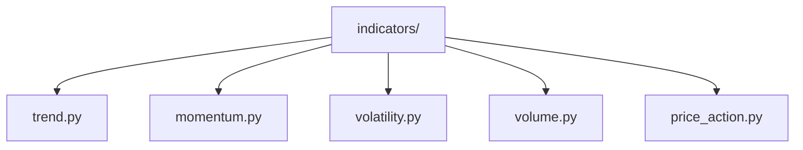

# Indicadores Técnicos Básicos

## [OBJETIVO] Objetivo

Este módulo contiene **indicadores técnicos básicos** organizados por categoría. Cada indicador es una función pura que recibe datos limpios y devuelve el DataFrame con nuevas columnas calculadas.

---

## [ESTRUCTURA] Estructura del Módulo



```
indicators/
├── trend.py          Indicadores de tendencia
├── momentum.py       Indicadores de momentum
├── volatility.py     Indicadores de volatilidad
├── volume.py         Indicadores de volumen
└── price_action.py   Análisis de acción de precio
```

---

## [TREND] Indicadores de Tendencia (`trend.py`)

### SMA (Simple Moving Average)

**Qué es**: Media aritmética simple de los precios durante un período.

**Qué problema resuelve**: Identifica la dirección general de la tendencia y suaviza el ruido del precio.

**Cuándo usarlo**:
- Identificar tendencias a largo plazo
- Como referencia para cruces de medias
- Como nivel de soporte/resistencia dinámico

**Configuración recomendada**:
- SMA 8 (corto plazo)
- SMA 18 (medio plazo)
- SMA 40 (largo plazo)

**Ventajas**:
- Simple y fácil de interpretar
- Ampliamente utilizado y reconocido
- Estable y no reactivo a cambios bruscos

**Limitaciones**:
- Retraso (lag) inherente
- Igual peso a todos los períodos
- Puede generar señales tardías

**Interpretación clásica**:
- Precio por encima de SMA: Tendencia alcista potencial
- Precio por debajo de SMA: Tendencia bajista potencial
- Cruce de SMAs: Posible cambio de tendencia

**Ejemplo conceptual**:
Si el precio de una acción es $100, $102, $98, $105, $103 en 5 días, la SMA de 5 períodos es (100+102+98+105+103)/5 = $101.6. Si el precio actual ($103) está por encima de la SMA, sugiere tendencia alcista.

---

### EMA (Exponential Moving Average)

**Qué es**: Media móvil que da más peso a los precios recientes usando una función exponencial.

**Qué problema resuelve**: Proporciona una respuesta más rápida a cambios de precio comparada con SMA, manteniendo suavizado.

**Cuándo usarlo**:
- Identificar cambios de tendencia más rápido que SMA
- En mercados volátiles donde se necesita sensibilidad
- Para estrategias de seguimiento de tendencia de corto plazo

**Configuración recomendada**:
- EMA 8 (corto plazo)
- EMA 18 (medio plazo)
- EMA 40 (largo plazo)

**Ventajas**:
- Más sensible a cambios recientes
- Menor retraso que SMA
- Útil para identificar entradas tempranas

**Limitaciones**:
- Más reactiva puede generar señales falsas
- Más compleja de calcular que SMA
- Puede ser demasiado sensible en mercados laterales

**Interpretación clásica**:
- Similar a SMA pero con señales más tempranas
- Cruce de EMA rápida por encima de lenta: Señal alcista
- Cruce de EMA rápida por debajo de lenta: Señal bajista

**Ejemplo conceptual**:
Si una EMA de 8 períodos está en $100 y el precio sube a $105, la EMA se moverá más rápido hacia $105 que una SMA equivalente, dando una señal más temprana de cambio de tendencia.

---

### Parabolic SAR

**Qué es**: Indicador que muestra puntos potenciales de reversión de precio usando una fórmula parabólica.

**Qué problema resuelve**: Identifica la dirección de la tendencia y posibles puntos de salida o reversión.

**Cuándo usarlo**:
- En mercados con tendencia clara
- Para identificar stops dinámicos
- Para confirmar dirección de tendencia

**Ventajas**:
- Señales claras de tendencia (SAR arriba/abajo del precio)
- Stop dinámico que se ajusta automáticamente
- Fácil de interpretar visualmente

**Limitaciones**:
- No funciona bien en mercados laterales
- Puede generar señales falsas en volatilidad alta
- Requiere tendencia clara para ser efectivo

**Interpretación clásica**:
- SAR por debajo del precio: Tendencia alcista (mantener posición larga)
- SAR por encima del precio: Tendencia bajista (mantener posición corta)
- Cambio de posición del SAR: Posible reversión de tendencia

**Ejemplo conceptual**:
Si el precio está en $100 y el SAR está en $95 (por debajo), indica tendencia alcista. Si el precio baja y el SAR cruza por encima a $98, indica cambio a tendencia bajista.

---

## [MOMENTUM] Indicadores de Momentum (`momentum.py`)

### RSI (Relative Strength Index)

**Qué es**: Oscilador que mide la velocidad y magnitud de cambios de precio, oscilando entre 0 y 100.

**Qué problema resuelve**: Identifica condiciones de sobrecompra y sobreventa, y posibles reversiones.

**Cuándo usarlo**:
- Identificar extremos de mercado
- Confirmar señales de otros indicadores
- Detectar divergencias con precio

**Ventajas**:
- Ampliamente reconocido y utilizado
- Normalizado (0-100) facilita comparación
- Útil para identificar reversiones

**Limitaciones**:
- Puede permanecer en extremos durante tendencias fuertes
- Genera señales falsas en mercados laterales
- No indica dirección de tendencia, solo momentum

**Interpretación clásica**:
- RSI > 70: Sobrecompra (posible señal de venta)
- RSI < 30: Sobreventa (posible señal de compra)
- RSI 30-70: Zona neutral
- Divergencia: RSI y precio se mueven en direcciones opuestas (señal de reversión)

**Ejemplo conceptual**:
Si el precio sube de $100 a $120 pero el RSI baja de 80 a 60, hay divergencia bajista: el precio sube pero el momentum se debilita, sugiriendo posible reversión.

---

### ADX (Average Directional Index)

**Qué es**: Mide la fuerza de una tendencia (no su dirección) usando los Directional Indicators (+DI y -DI).

**Qué problema resuelve**: Distingue entre mercados con tendencia fuerte y mercados laterales sin tendencia.

**Cuándo usarlo**:
- Filtrar señales en mercados sin tendencia
- Confirmar fuerza de una tendencia existente
- Identificar cuándo usar estrategias de tendencia vs. reversión

**Ventajas**:
- Mide fuerza objetiva de tendencia
- Útil para filtrar señales falsas
- Complementa otros indicadores direccionales

**Limitaciones**:
- No indica dirección, solo fuerza
- Puede tener retraso
- Requiere interpretación junto con +DI y -DI

**Interpretación clásica**:
- ADX > 25: Tendencia fuerte (usar estrategias de tendencia)
- ADX 20-25: Tendencia moderada
- ADX < 20: Mercado sin tendencia (evitar estrategias de tendencia)
- +DI > -DI: Tendencia alcista
- -DI > +DI: Tendencia bajista

**Ejemplo conceptual**:
Si ADX está en 30 y +DI está en 25 mientras -DI está en 10, indica una tendencia alcista fuerte. Si ADX cae a 15, sugiere que la tendencia se está debilitando y el mercado puede volverse lateral.

---

### Stochastic RSI

**Qué es**: Versión estocástica del RSI que oscila entre 0 y 1 (o 0-100), más sensible que el RSI estándar.

**Qué problema resuelve**: Proporciona señales más tempranas y frecuentes que el RSI estándar.

**Cuándo usarlo**:
- Cuando se necesitan señales más tempranas que RSI
- En mercados con movimientos rápidos
- Para identificar extremos más precisamente

**Ventajas**:
- Más sensible que RSI estándar
- Más señales (puede ser ventaja o desventaja)
- Útil para timing de entradas

**Limitaciones**:
- Más señales falsas que RSI estándar
- Puede ser demasiado sensible
- Requiere filtros adicionales

**Interpretación clásica**:
- StochRSI > 0.8: Sobrecompra extrema
- StochRSI < 0.2: Sobreventa extrema
- Cruce de %K y %D: Señales de cambio de momentum

**Ejemplo conceptual**:
Si el RSI está en 65 (neutral) pero el StochRSI está en 0.9 (sobrecompra extrema), puede indicar que aunque el RSI no está en extremo, el momentum reciente es muy fuerte y puede haber reversión próxima.

---

## [VOLATILITY] Indicadores de Volatilidad (`volatility.py`)

### ATR (Average True Range)

**Qué es**: Mide la volatilidad promedio del mercado calculando el promedio del True Range.

**Qué problema resuelve**: Proporciona una medida objetiva de volatilidad para ajustar stops, posición sizing y estrategias.

**Cuándo usarlo**:
- Ajustar stops dinámicos (stop = precio ± ATR × multiplicador)
- Determinar tamaño de posición según volatilidad
- Identificar períodos de alta/baja volatilidad

**Ventajas**:
- Mide volatilidad objetiva
- No depende de dirección de precio
- Útil para gestión de riesgo

**Limitaciones**:
- No indica dirección
- Puede tener retraso
- Valores absolutos (no normalizados)

**Interpretación clásica**:
- ATR alto: Alta volatilidad (mercado volátil, stops más amplios)
- ATR bajo: Baja volatilidad (mercado tranquilo, stops más ajustados)
- ATR creciente: Volatilidad aumentando
- ATR decreciente: Volatilidad disminuyendo

**Ejemplo conceptual**:
Si el ATR de una acción es $2 y el precio está en $100, un stop a 2×ATR estaría en $96 o $104. Si el ATR aumenta a $4, el stop se ampliaría a $92 o $108 para acomodar mayor volatilidad.

---

### Bollinger Bands

**Qué es**: Bandas de volatilidad alrededor de una SMA usando desviaciones estándar.

**Qué problema resuelve**: Identifica condiciones de sobrecompra/sobreventa relativas y cambios en volatilidad.

**Cuándo usarlo**:
- Identificar extremos relativos de precio
- Detectar cambios en volatilidad (expansión/contracción de bandas)
- Confirmar señales de otros indicadores

**Ventajas**:
- Adaptativo a cambios en volatilidad
- Proporciona contexto relativo (sobrecompra/sobreventa)
- Ampliamente reconocido

**Limitaciones**:
- Puede generar señales falsas en tendencias fuertes
- No funciona bien en mercados laterales extremos
- Requiere interpretación junto con otros indicadores

**Interpretación clásica**:
- Precio toca banda superior: Posible sobrecompra
- Precio toca banda inferior: Posible sobreventa
- Bandas se expanden: Aumento de volatilidad
- Bandas se contraen: Disminución de volatilidad (posible breakout próximo)
- Precio entre bandas: Rango normal

**Ejemplo conceptual**:
Si las Bollinger Bands están en $95 (inferior), $100 (media), $105 (superior) y el precio toca $105, sugiere sobrecompra relativa. Si las bandas se contraen de $90-$110 a $98-$102, indica baja volatilidad y posible breakout próximo.

---

## [VOLUME] Indicadores de Volumen (`volume.py`)

### Volume Indicators

**Qué es**: Análisis básico de volumen incluyendo SMA de volumen, ratio de volumen y cambio porcentual.

**Qué problema resuelve**: Proporciona contexto sobre la fuerza detrás de los movimientos de precio.

**Cuándo usarlo**:
- Confirmar movimientos de precio (alto volumen = movimiento fuerte)
- Identificar acumulación/distribución
- Detectar cambios en interés del mercado

**Ventajas**:
- Simple y directo
- Proporciona contexto importante
- Fácil de interpretar

**Limitaciones**:
- No indica dirección
- Puede variar según el activo
- Requiere comparación con histórico

**Interpretación clásica**:
- Volumen alto en subida: Movimiento alcista fuerte
- Volumen alto en bajada: Movimiento bajista fuerte
- Volumen bajo: Movimiento débil o indeciso
- Ratio > 1: Volumen por encima del promedio

---

### VWAP (Volume Weighted Average Price)

**Qué es**: Precio promedio ponderado por volumen durante un período (típicamente un día).

**Qué problema resuelve**: Proporciona referencia de precio "justo" y nivel de soporte/resistencia dinámico.

**Cuándo usarlo**:
- Como referencia de precio intraday
- Como nivel de soporte/resistencia dinámico
- Para evaluar ejecución de órdenes

**Ventajas**:
- Ampliamente usado por instituciones
- Nivel de soporte/resistencia dinámico
- Referencia objetiva de precio

**Limitaciones**:
- Se recalcula cada día
- Puede no ser relevante en timeframes largos
- Requiere datos de volumen precisos

**Interpretación clásica**:
- Precio por encima de VWAP: Sentimiento alcista
- Precio por debajo de VWAP: Sentimiento bajista
- VWAP actúa como soporte/resistencia
- Precio cerca de VWAP: Precio "justo"

---

### MFI (Money Flow Index)

**Qué es**: Similar al RSI pero incorpora volumen, midiendo el flujo de dinero hacia o desde un activo.

**Qué problema resuelve**: Identifica sobrecompra/sobreventa considerando tanto precio como volumen.

**Cuándo usarlo**:
- Cuando el volumen es importante para la señal
- Confirmar señales de RSI con volumen
- Identificar acumulación/distribución

**Ventajas**:
- Incorpora volumen (más completo que RSI)
- Similar interpretación a RSI
- Útil para confirmar señales

**Limitaciones**:
- Requiere datos de volumen precisos
- Similar a RSI pero más complejo
- Puede tener retraso

**Interpretación clásica**:
- MFI > 80: Sobrecompra (posible señal de venta)
- MFI < 20: Sobreventa (posible señal de compra)
- MFI 20-80: Zona neutral
- Similar a RSI pero con contexto de volumen

---

### Market Profile

**Qué es**: Distribución precio-tiempo que identifica áreas de alta y baja actividad (POC, Value Area).

**Qué problema resuelve**: Identifica niveles de precio donde el mercado pasa más tiempo (soportes/resistencias).

**Cuándo usarlo**:
- Identificar niveles de soporte/resistencia
- Entender estructura de mercado
- Análisis de acumulación/distribución

**Ventajas**:
- Proporciona contexto de estructura de mercado
- Identifica niveles importantes
- Útil para trading de rango

**Limitaciones**:
- Implementación simplificada (completo requiere TPOs)
- Requiere interpretación avanzada
- Mejor para análisis diario

**Interpretación clásica**:
- POC (Point of Control): Precio más frecuente (soporte/resistencia fuerte)
- Value Area: Rango con 70% de actividad (zona de valor)
- Precio fuera de Value Area: Posible retorno a la zona

---

### Volume Profile

**Qué es**: Distribución precio-volumen que muestra dónde se negoció más volumen a cada nivel de precio.

**Qué problema resuelve**: Identifica niveles de precio con alta actividad de volumen (soportes/resistencias).

**Cuándo usarlo**:
- Identificar soportes/resistencias basados en volumen
- Entender acumulación/distribución
- Análisis de estructura de mercado

**Ventajas**:
- Visualización clara de actividad por precio
- Identifica niveles importantes
- Útil para múltiples timeframes

**Limitaciones**:
- Requiere datos históricos suficientes
- Puede cambiar con el tiempo
- Mejor para análisis de rango

**Interpretación clásica**:
- POC: Nivel con mayor volumen (soporte/resistencia fuerte)
- High Volume Nodes: Áreas de alta actividad (soportes/resistencias)
- Low Volume Nodes: Áreas de baja actividad (zonas de ruptura)
- Value Area: Rango con 70% del volumen

---

## [PRICE_ACTION] Análisis de Acción de Precio (`price_action.py`)

### Fractales

**Qué es**: Patrones de 5 barras donde la barra del medio es el máximo o mínimo local.

**Qué problema resuelve**: Identifica máximos y mínimos locales para identificar niveles de soporte/resistencia.

**Cuándo usarlo**:
- Identificar niveles de soporte/resistencia
- Detectar posibles puntos de reversión
- Análisis de estructura de precio

**Ventajas**:
- Simple y objetivo
- Identifica niveles claros
- Útil para múltiples timeframes

**Limitaciones**:
- Puede generar muchos niveles
- Requiere confirmación
- Mejor usado con otros indicadores

**Interpretación clásica**:
- Fractal alcista: Mínimo local (posible soporte)
- Fractal bajista: Máximo local (posible resistencia)
- Múltiples fractales al mismo nivel: Nivel fuerte
- Precio respeta fractales: Nivel válido

---

### Wyckoff (Conceptual)

**Qué es**: Método de análisis que identifica fases de acumulación, markup, distribución y markdown.

**Qué problema resuelve**: Proporciona marco conceptual para entender ciclos de mercado y actividad institucional.

**Cuándo usarlo**:
- Análisis de estructura de mercado
- Identificar fases de mercado
- Entender actividad institucional

**Ventajas**:
- Marco conceptual sólido
- Útil para análisis de largo plazo
- Proporciona contexto de mercado

**Limitaciones**:
- Implementación simplificada (análisis completo requiere interpretación manual)
- Subjetivo en algunos aspectos
- Mejor para análisis cualitativo

**Interpretación clásica**:
- Accumulation: Fase inicial de compra institucional
- Markup: Tendencia alcista
- Distribution: Fase inicial de venta institucional
- Markdown: Tendencia bajista

**NOTA**: Esta implementación es conceptual y simplificada. El análisis Wyckoff completo requiere interpretación manual de múltiples factores.

---

## [USO] Uso General

Todos los indicadores siguen el mismo patrón:

```python
from src.analisis.technical.indicators import trend, momentum, volatility, volume, price_action

# Calcular indicador
df = trend.calculate_sma_series(df)
df = momentum.calculate_rsi(df, period=14)
df = volatility.calculate_bollinger_bands(df, period=20, std_dev=2)

# Acceder a resultados
df['SMA_8']  # Media móvil simple
df['RSI_14']  # RSI
df['BB_20_Upper']  # Banda superior de Bollinger
```

---

## [NOTAS] Notas Importantes

1. **Datos limpios requeridos**: Todos los indicadores asumen datos ya limpios del módulo `data/cleaning`.

2. **Funciones puras**: No modifican estado global, solo añaden columnas al DataFrame.

3. **No generan señales**: Estos son solo indicadores. Las señales y estrategias se implementan en módulos separados.

4. **Combinación recomendada**: Los indicadores funcionan mejor cuando se combinan múltiples categorías (tendencia + momentum + volumen).

5. **Parámetros configurables**: Todos los períodos y parámetros son configurables según el activo y timeframe.
