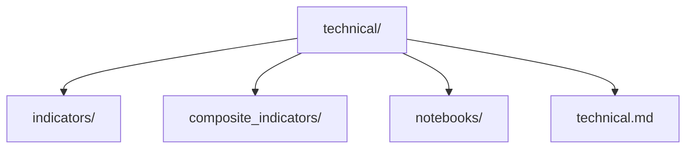

# Módulo de Análisis Técnico

## [OBJETIVO] Objetivo

Este módulo proporciona una **colección completa de indicadores técnicos** para análisis de datos financieros. Los indicadores están organizados en categorías y son funciones puras que pueden combinarse para crear análisis técnico robusto.

**Filosofía clave**: Este módulo solo calcula indicadores. No genera señales de trading ni estrategias. Es la base sobre la cual se construirán módulos de estrategias y scoring.

---

## [FILOSOFIA] Filosofía del Análisis Técnico

### ¿Qué es el Análisis Técnico?

El análisis técnico es el estudio de movimientos de precio y volumen históricos para predecir movimientos futuros. Se basa en tres principios fundamentales:

1. **El precio descuenta todo**: Toda la información relevante está reflejada en el precio
2. **Los precios se mueven en tendencias**: Las tendencias persisten hasta que se revierten
3. **La historia se repite**: Los patrones históricos tienden a repetirse

### Limitaciones del Análisis Técnico

Es importante reconocer las limitaciones:

- **No predice el futuro con certeza**: Solo proporciona probabilidades
- **Puede generar señales falsas**: Especialmente en mercados laterales
- **Requiere combinación**: Un solo indicador rara vez es suficiente
- **Depende del contexto**: Funciona mejor en ciertos tipos de mercado
- **No considera fundamentales**: Ignora eventos corporativos y macroeconómicos

### Cuándo es Útil

- **Mercados con tendencia**: Funciona mejor cuando hay tendencias claras
- **Timeframes cortos**: Más útil en análisis de corto plazo
- **Liquidez alta**: Requiere suficiente volumen para ser confiable
- **Como complemento**: Mejor cuando se combina con análisis fundamental

---

## [ESTRUCTURA] Estructura del Módulo



```
src/analisis/technical/
├── indicators/              Indicadores básicos por categoría
│   ├── trend.py            Indicadores de tendencia
│   ├── momentum.py         Indicadores de momentum
│   ├── volatility.py       Indicadores de volatilidad
│   ├── volume.py           Indicadores de volumen
│   ├── price_action.py     Análisis de acción de precio
│   └── indicators.md       Documentación exhaustiva
│
├── composite_indicators/    Indicadores compuestos avanzados
│   ├── macd.py             MACD
│   ├── ichimoku.py         Ichimoku Cloud
│   ├── supertrend.py       SuperTrend
│   ├── adaptive_ma.py       Medias móviles adaptativas
│   └── composite_indicators.md  Documentación exhaustiva
│
├── notebooks/              Notebooks de test y ejemplos
│   ├── indicators_test.ipynb
│   └── composite_indicators_test.ipynb
│
└── technical.md            Este archivo
```

---

## [INDICADORES_BASICOS] Indicadores Básicos vs. Compuestos

### Indicadores Básicos

Los indicadores básicos miden un aspecto específico del mercado:

**Categorías**:
- **Tendencia**: SMA, EMA, Parabolic SAR
- **Momentum**: RSI, ADX, Stochastic RSI
- **Volatilidad**: ATR, Bollinger Bands
- **Volumen**: Volume indicators, VWAP, MFI, Market Profile, Volume Profile
- **Acción de Precio**: Fractales, Wyckoff (conceptual)

**Características**:
- Cálculo directo y simple
- Interpretación más directa
- Miden un aspecto específico
- Fáciles de entender y usar

**Cuándo usar**:
- Cuando se necesita medir un aspecto específico
- Para análisis inicial y exploratorio
- Como componentes de análisis más complejo
- Para validación y confirmación

### Indicadores Compuestos

Los indicadores compuestos combinan múltiples componentes:

**Indicadores disponibles**:
- **MACD**: Combina múltiples EMAs para momentum y tendencia
- **Ichimoku**: Sistema completo con 5 componentes
- **SuperTrend**: Combina ATR y precio para tendencia adaptativa
- **Adaptive MA**: Ajusta velocidad según volatilidad

**Características**:
- Cálculo más complejo
- Interpretación más rica pero también más compleja
- Integran múltiples conceptos
- Proporcionan visión más holística

**Cuándo usar**:
- Cuando se necesita análisis más completo
- Para sistemas de trading más sofisticados
- Cuando se quiere reducir número de indicadores
- Para análisis de múltiples aspectos simultáneamente

---

## [INTEGRACION] Integración con Otros Módulos

### Con Módulo de Datos

**Entrada requerida**:
- Datos OHLCV limpios del módulo `data/cleaning`
- Datos ordenados cronológicamente
- Sin gaps temporales significativos

**Flujo**:
```
DataProvider (extracción)
    ↓
DataCleaner (limpieza)
    ↓
Indicadores Técnicos (cálculo)
```

**Ejemplo**:
```python
from src.data import DataProvider, DataCleaner
from src.analisis.technical.indicators import trend, momentum

# Obtener y limpiar datos
provider = DataProvider()
raw_data = provider.get_price_data("AAPL", period="1y")

cleaner = DataCleaner()
cleaned_data, metadata = cleaner.clean_price_data(raw_data)

# Calcular indicadores
df = trend.calculate_sma_series(cleaned_data)
df = momentum.calculate_rsi(df, period=14)
```

### Con Análisis Fundamental

**Complementariedad**:
- **Análisis Técnico**: Qué está pasando (precio, volumen, momentum)
- **Análisis Fundamental**: Por qué está pasando (métricas financieras, eventos)

**Uso combinado**:
- Análisis técnico para timing de entrada/salida
- Análisis fundamental para selección de activos
- Confirmación cruzada entre ambos enfoques

**Ejemplo conceptual**:
Una empresa con fundamentales sólidos (análisis fundamental positivo) pero precio en sobreventa técnica (RSI < 30) puede ser una oportunidad de compra. El análisis técnico ayuda a identificar el mejor momento de entrada.

### Con Sistema de Scoring

**Rol del análisis técnico**:
- Proporciona señales normalizadas (-1 a +1)
- Contribuye al score técnico
- Se combina con señales fundamentales

**Flujo**:
```
Indicadores Técnicos
    ↓
Señales Normalizadas
    ↓
Scoring Engine
    ↓
Score Unificado
```

**Ejemplo**:
- RSI > 70 → Señal técnica negativa (-0.5)
- MACD cruce alcista → Señal técnica positiva (+0.7)
- Bollinger Bands sobrecompra → Señal técnica negativa (-0.3)
- Agregación → Score técnico total

---

## [USO] Uso del Módulo

### Patrón Básico

Todos los indicadores siguen el mismo patrón:

```python
# 1. Importar el módulo
from src.analisis.technical.indicators import trend, momentum

# 2. Calcular indicador (añade columnas al DataFrame)
df = trend.calculate_sma_series(df)

# 3. Acceder a resultados
df['SMA_8']  # Columna con la SMA de corto plazo
```

### Combinación de Indicadores

```python
from src.analisis.technical.indicators import trend, momentum, volatility, volume
from src.analisis.technical.composite_indicators import macd

# Calcular múltiples indicadores
df = trend.calculate_sma_series(df)
df = trend.calculate_ema_series(df)
df = momentum.calculate_rsi(df, period=14)
df = volatility.calculate_bollinger_bands(df, period=20)
df = volume.calculate_vwap(df)
df = macd.calculate_macd(df)

# Ahora df tiene múltiples columnas de indicadores
```

### Parámetros Configurables

Todos los indicadores tienen parámetros configurables:

```python
# SMA con período personalizado
df = trend.calculate_sma(df, period=18)

# RSI con período y nombre de columna personalizados
df = momentum.calculate_rsi(df, period=21, output_column='RSI_Long')

# Bollinger Bands con múltiples parámetros
df = volatility.calculate_bollinger_bands(
    df, 
    period=20, 
    std_dev=2.5,
    output_prefix='BB_Custom'
)
```

---

## [BEST_PRACTICES] Mejores Prácticas

### 1. Siempre usar datos limpios

Los indicadores asumen datos limpios. Siempre pasar datos por `DataCleaner` primero.

### 2. Combinar múltiples categorías

No depender de un solo tipo de indicador:
- Tendencia + Momentum + Volumen
- Técnico + Fundamental

### 3. Validar con datos históricos

Antes de usar en trading real, validar con datos históricos (backtesting).

### 4. Ajustar parámetros según activo

Diferentes activos pueden requerir diferentes parámetros:
- Acciones: RSI 14, SMA 8/18/40
- Criptomonedas: Puede requerir períodos más cortos
- Forex: Puede requerir períodos más largos

### 5. Entender limitaciones

Cada indicador tiene limitaciones. Entenderlas antes de usar.

### 6. No sobrecargar con indicadores

Demasiados indicadores pueden generar señales contradictorias. Mejor pocos bien entendidos que muchos sin entender.

---

## [LIMITACIONES] Limitaciones del Módulo

### Limitaciones Técnicas

1. **No genera señales**: Solo calcula indicadores. Las señales se generan en módulos separados.

2. **No optimiza parámetros**: Los parámetros deben ajustarse manualmente o en módulos de optimización.

3. **No hace backtesting**: El backtesting se hace en módulos separados.

4. **Requiere datos limpios**: Asume datos ya procesados por `DataCleaner`.

### Limitaciones Conceptuales

1. **Análisis técnico tiene limitaciones**: No predice el futuro con certeza.

2. **Puede generar señales falsas**: Especialmente en mercados laterales.

3. **Requiere combinación**: Un solo indicador rara vez es suficiente.

4. **Depende del contexto**: Funciona mejor en ciertos tipos de mercado.

---

## [FUTURO] Mejoras Futuras

### Indicadores Adicionales

- Más indicadores de momentum (CCI, Williams %R)
- Más indicadores de volumen (OBV avanzado)
- Indicadores de ciclo (Elliott Wave básico)
- Indicadores de sentimiento (si hay datos disponibles)

### Optimización

- Optimización automática de parámetros
- Detección automática de mejores períodos
- Validación estadística de indicadores

### Machine Learning

- Indicadores basados en ML
- Detección automática de patrones
- Predicción de mejor indicador según condiciones

### Integración

- Integración más profunda con análisis fundamental
- Señales automáticas normalizadas
- Backtesting integrado

---

## [DOCUMENTACION] Documentación Adicional

Para información detallada sobre cada categoría:

- **Indicadores básicos**: Ver `indicators/indicators.md`
- **Indicadores compuestos**: Ver `composite_indicators/composite_indicators.md`
- **Ejemplos de uso**: Ver notebooks en `notebooks/`

---

## [NOTAS] Notas Finales

Este módulo es la **base** del sistema de análisis técnico. Proporciona las herramientas necesarias para calcular indicadores, pero la interpretación, generación de señales y estrategias se implementan en módulos separados.

**Filosofía de diseño**:
- **Modular**: Cada indicador es independiente
- **Extensible**: Fácil añadir nuevos indicadores
- **Explicable**: Código claro y documentado
- **Preparado para crecer**: Arquitectura escalable
