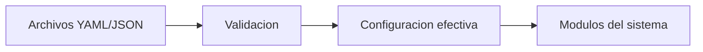

# [CONFIG] Módulo de Configuración

## [UBICACION] Ubicación

`src/config/`

## [OBJETIVO] Objetivo

Este módulo maneja la configuración del sistema, incluyendo parámetros, pesos y ajustes.

## [ESTADO] Estado Actual

Módulo en desarrollo inicial. Pendiente de implementación.

## [PLANIFICADO] Funcionalidades Planificadas

- Carga de configuración desde archivos (YAML/JSON)
- Parámetros por defecto
- Validación de configuración
- Gestión de pesos del scoring
- Configuración por activo/tipo de mercado
- Ajustes de umbrales de decisión
