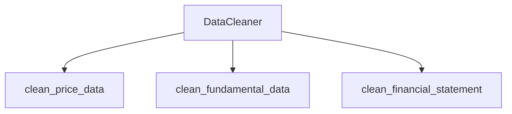

# [CLEANING] Módulo de Limpieza y Preprocesamiento de Datos Financieros

## [UBICACION] Ubicación

`src/data/cleaning/`

## [OBJETIVO] Objetivo

Este módulo se encarga de **limpiar, normalizar y validar** datos financieros obtenidos de cualquier fuente, preparándolos para análisis posterior (técnico, fundamental, scoring).

**Filosofía clave**: Separación estricta entre extracción y limpieza. Este módulo asume que los datos ya han sido descargados.

---

## [PROBLEMAS] Problemas que Soluciona

### Problemas Comunes en Datos Financieros

1. **Valores nulos/missing**
   - Días sin trading
   - Errores en la fuente de datos
   - Problemas de red durante descarga

2. **Duplicados**
   - Múltiples descargas del mismo día
   - Errores en el proceso de extracción

3. **Relaciones OHLC inválidas**
   - High < Low
   - Close fuera del rango [Low, High]
   - Errores de datos en la fuente

4. **Problemas de formato**
   - Nombres de columnas inconsistentes
   - Tipos de datos incorrectos
   - Índices no datetime

5. **Outliers**
   - Errores de entrada de datos
   - Eventos excepcionales (splits mal procesados)

6. **Falta de métricas derivadas**
   - Returns no calculados
   - Volatilidad no calculada
   - Métricas auxiliares faltantes

---

## [ARQUITECTURA] Arquitectura del Módulo



```
DataCleaner
├── clean_price_data()
│   ├── Normalización de nombres
│   ├── Validación de índice datetime
│   ├── Ordenamiento cronológico
│   ├── Eliminación de duplicados
│   ├── Validación OHLC
│   ├── Manejo de valores nulos
│   ├── Detección de outliers
│   └── Añadir columnas auxiliares
│
├── clean_fundamental_data()
│   ├── Normalización de claves
│   ├── Manejo de None/NaN
│   ├── Conversión de tipos
│   └── Validación de ratios
│
└── clean_financial_statement()
    ├── Normalización de métricas
    ├── Ordenamiento cronológico
    ├── Manejo de valores nulos
    └── Eliminación de filas vacías
```

---

## [USO] Uso Básico

### Limpieza de Datos de Precios

```python
from src.data.cleaning import DataCleaner

# Crear limpiador
cleaner = DataCleaner(
    fill_method='forward',      # 'forward', 'backward', 'interpolate', 'drop'
    remove_outliers=False,      # Si eliminar outliers automáticamente
    validate_ohlc=True,         # Validar relaciones OHLC
    normalize_column_names=True # Normalizar nombres
)

# Limpiar datos
cleaned_data, metadata = cleaner.clean_price_data(price_data, symbol="AAPL")

# Ver qué se hizo
print(metadata.summary())
```

### Limpieza de Datos Fundamentales

```python
# Limpiar datos fundamentales
cleaned_fundamental, metadata = cleaner.clean_fundamental_data(fundamental_data)

# Los datos están normalizados y validados
print(metadata.warnings)  # Ver advertencias detectadas
```

### Limpieza de Estados Financieros

```python
# Limpiar income statement
cleaned_income, metadata = cleaner.clean_financial_statement(
    income_statement, 
    statement_type="income"
)
```

### Funciones de Conveniencia

```python
from src.data.cleaning import clean_price_data, clean_fundamental_data

# Uso rápido
cleaned, metadata = clean_price_data(price_data, symbol="AAPL")
```

---

## [PROCESOS] Procesos de Limpieza Detallados

### Para Datos de Precios (OHLCV)

1. **Normalización de nombres**
   - `Open` → `open`
   - `Close` → `close`
   - Consistencia en todo el sistema

2. **Validación de índice**
   - Conversión a DatetimeIndex si es necesario
   - Manejo de zonas horarias

3. **Ordenamiento**
   - Orden cronológico ascendente
   - Necesario para cálculos de returns

4. **Eliminación de duplicados**
   - Mantiene la primera ocurrencia
   - Elimina duplicados por fecha

5. **Validación OHLC**
   - High >= max(Open, Close)
   - Low <= min(Open, Close)
   - Close entre [Low, High]

6. **Manejo de valores nulos**
   - **Forward-fill**: Usa último valor conocido (recomendado para precios)
   - **Backward-fill**: Usa siguiente valor conocido
   - **Interpolate**: Interpolación temporal
   - **Drop**: Elimina filas con nulos

7. **Detección de outliers**
   - Método de desviaciones estándar (Z-score)
   - Configurable threshold (default: 3σ)

8. **Columnas auxiliares añadidas**
   - `returns`: Returns simples (pct_change)
   - `log_returns`: Returns logarítmicos
   - `price_change`: Cambio absoluto de precio
   - `pct_change`: Cambio porcentual
   - `volatility_20`: Volatilidad rolling 20 días

### Para Datos Fundamentales

1. **Normalización de claves**
   - Minúsculas y sin espacios
   - Consistencia en nombres

2. **Manejo de None/NaN**
   - Preserva None para indicar datos faltantes
   - No imputa valores (diferente a precios)

3. **Conversión de tipos**
   - Números a float
   - Strings normalizados

4. **Validación de ratios**
   - Ratios positivos deben ser positivos
   - Porcentajes en rangos razonables
   - Advertencias para valores sospechosos

### Para Estados Financieros

1. **Normalización de métricas**
   - Nombres de filas normalizados
   - Consistencia en nomenclatura

2. **Ordenamiento cronológico**
   - Columnas ordenadas (más reciente primero)
   - Facilita análisis de tendencias

3. **Manejo de valores nulos**
   - Reemplazo con 0 (común en estados financieros)
   - Alternativa: mantener NaN según necesidad

4. **Eliminación de filas vacías**
   - Métricas sin datos en ningún período
   - Limpieza de datos innecesarios

---

## [METADATA] Metadata y Trazabilidad

Cada operación de limpieza retorna un objeto `CleaningMetadata` que contiene:

- **Forma original y final**: Tamaño antes y después
- **Filas/columnas eliminadas**: Qué se quitó y por qué
- **Valores nulos**: Cuántos se imputaron/eliminaron
- **Duplicados**: Cuántos se encontraron
- **Outliers**: Cuántos se detectaron
- **Advertencias**: Problemas detectados pero no corregidos automáticamente
- **Transformaciones**: Lista de todas las transformaciones aplicadas

**Ejemplo de uso**:

```python
cleaned, metadata = cleaner.clean_price_data(data)

# Ver resumen
print(metadata.summary())

# Acceder a campos específicos
print(f"Filas eliminadas: {metadata.rows_removed}")
print(f"Advertencias: {metadata.warnings}")

# Convertir a diccionario
metadata_dict = metadata.to_dict()
```

---

## [INTEGRACION] Integración con Otros Módulos

### Flujo de Datos

```
DataProvider (extracción)
    ↓
DataCleaner (limpieza)
    ↓
┌─────────────────┬─────────────────┐
│ Análisis Técnico│ Análisis        │
│                 │ Fundamental     │
└─────────────────┴─────────────────┘
    ↓
Scoring Engine
    ↓
Decision Engine
```

### Por qué es Importante

1. **Análisis Técnico**
   - Requiere datos limpios y ordenados
   - Returns calculados correctamente
   - Sin gaps que distorsionen indicadores

2. **Análisis Fundamental**
   - Ratios calculados sobre datos consistentes
   - Comparaciones temporales válidas
   - Métricas normalizadas

3. **Scoring**
   - Señales basadas en datos confiables
   - Sin sesgos por datos sucios
   - Reproducibilidad garantizada

4. **Backtesting**
   - Datos históricos limpios
   - Sin errores que afecten resultados
   - Validación de estrategias confiable

---

## [CONFIGURACION] Opciones de Configuración

### Métodos de Fill

- **forward**: Último valor conocido (recomendado para precios)
- **backward**: Siguiente valor conocido
- **interpolate**: Interpolación temporal
- **drop**: Elimina filas con nulos

### Detección de Outliers

- **remove_outliers=False**: Solo detecta, no elimina
- **remove_outliers=True**: Elimina automáticamente
- **outlier_threshold**: Desviaciones estándar (default: 3.0)

### Validación OHLC

- **validate_ohlc=True**: Valida y elimina filas inválidas
- **validate_ohlc=False**: No valida (más rápido, menos seguro)

---

## [BEST_PRACTICES] Mejores Prácticas

1. **Siempre revisar metadata**
   - Ver qué se limpió
   - Revisar advertencias
   - Entender transformaciones

2. **Elegir método de fill apropiado**
   - Forward-fill para precios
   - Drop para análisis que requieren datos completos

3. **Validar OHLC siempre**
   - Datos inválidos pueden causar errores graves
   - Mejor detectar temprano

4. **No eliminar outliers automáticamente**
   - Pueden ser eventos reales importantes
   - Mejor detectar y revisar manualmente

5. **Usar datos limpios consistentemente**
   - No mezclar datos crudos y limpios
   - Establecer pipeline claro

---

## [EJEMPLOS] Ejemplos Conceptuales

### Ejemplo 1: Datos con Valores Nulos

**Problema**: Día sin trading genera NaN en Close

**Solución**: Forward-fill usa el último precio conocido

**Resultado**: Datos continuos para análisis técnico

### Ejemplo 2: Relación OHLC Inválida

**Problema**: High=100, Low=105 (físicamente imposible)

**Solución**: Validación detecta y elimina la fila

**Resultado**: Datos consistentes, advertencia en metadata

### Ejemplo 3: Duplicados por Re-descarga

**Problema**: Mismo día descargado dos veces

**Solución**: Eliminación de duplicados mantiene primera ocurrencia

**Resultado**: Una sola fila por fecha

### Ejemplo 4: Falta de Returns

**Problema**: Solo tenemos precios, no returns

**Solución**: DataCleaner calcula returns automáticamente

**Resultado**: Columnas listas para análisis técnico

---

## [AVISO] Notas Importantes

- Este módulo **NO descarga datos**, solo limpia datos ya obtenidos
- La limpieza es **conservadora**: mejor detectar problemas que ocultarlos
- La metadata es **crucial**: siempre revisarla para entender qué pasó
- Los datos limpios son **inmutables**: no modifica los datos originales
