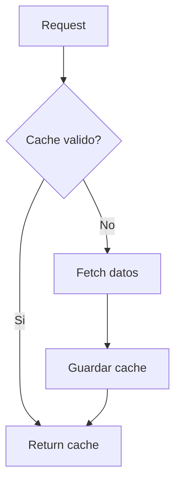

# Data Provider (Yahoo Finance)

## Objetivo
Proveer datos de mercado y fundamentales con cache local.

## Que hace
| Aspecto | Descripcion |
| --- | --- |
| Entradas | Simbolo, periodo, intervalo |
| Salidas | Precios, fundamentales, estados financieros |
| Cache | TTL configurable con fallback |

## Inputs / Outputs
| Tipo | Descripcion |
| --- | --- |
| Inputs | `symbol`, `period`, `interval` |
| Outputs | `price_data`, `fundamental_data`, `financial_statements` |

## Flujo de cache

## Notas / Limitaciones
- Fuente: Yahoo Finance (`yfinance`).
- Datos pueden tener retraso.
- Cache es local por proceso.
