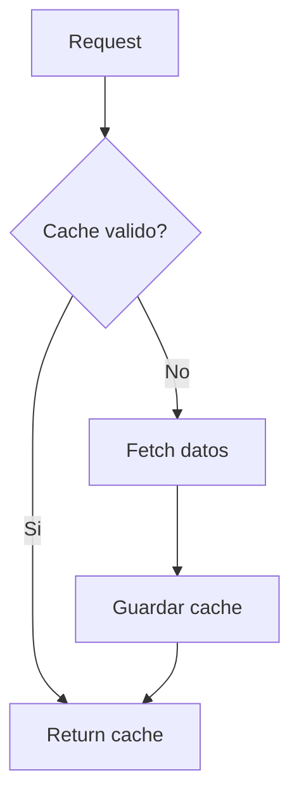

# Data Provider (Yahoo Finance)

## Objetivo
Proveer datos de mercado y fundamentales con cache local.

## Que hace
| Aspecto | Descripcion |
| --- | --- |
| Entradas | Simbolo, periodo, intervalo |
| Salidas | Precios, fundamentales, estados financieros |
| Cache | TTL configurable con fallback |

## Inputs / Outputs
| Tipo | Descripcion |
| --- | --- |
| Inputs | `symbol`, `period`, `interval` |
| Outputs | `price_data`, `fundamental_data`, `financial_statements` |

## Funciones clave
| Funcion | Descripcion |
| --- | --- |
| `DataProvider.get_price_data` | Precios OHLCV |
| `DataProvider.get_fundamental_data` | Metricas fundamentales |
| `DataProvider.get_financial_statements` | Estados financieros |
| `DataProvider.get_all_data` | Paquete completo de datos |
| `DataProvider.clear_cache` | Limpieza de cache |
| `get_data` | Acceso rapido a `get_all_data` |
| `format_number` | Formateo numerico |

## Flujo de cache

## Notas / Limitaciones
- Fuente: Yahoo Finance (`yfinance`).
- Datos pueden tener retraso.
- Cache es local por proceso.
