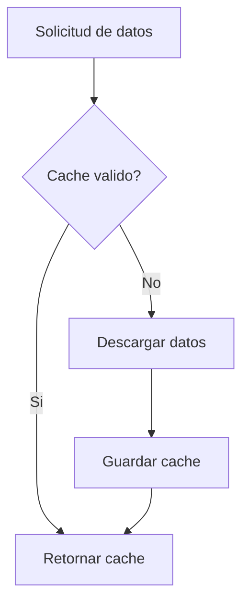

# [DATA] Módulo de Extracción de Datos - Yahoo Finance

## [UBICACION] Ubicación

`src/data/raw/`

## [OBJETIVO] Objetivo

Este módulo proporciona una interfaz unificada para obtener datos financieros desde **Yahoo Finance** usando `yfinance` como proveedor principal.

**Nota**: Este es el módulo de extracción específico para Yahoo Finance. Para otros proveedores, crear módulos similares en `src/data/raw/`.

---

## [CARACTERISTICAS] Características Principales

- **Abstracción de fuente de datos**: Interfaz única independiente del proveedor
- **Cache local**: Evita llamadas innecesarias a APIs externas
- **Manejo robusto de errores**: Gestión adecuada de fallos y datos faltantes
- **Normalización**: Datos consistentes independientemente de la fuente
- **Múltiples tipos de datos**: Precios, fundamentales, estados financieros
- **Reintentos automáticos**: Backoff exponencial en caso de fallos
- **Fallback a cache**: Usa datos antiguos si la descarga falla

---

## [ARQUITECTURA] Arquitectura

```
DataProvider
├── Cache Management
│   ├── Validación TTL
│   ├── Guardado/Lectura
│   └── Limpieza
├── Price Data
│   └── Históricos OHLCV
├── Fundamental Data
│   └── Métricas y ratios
└── Financial Statements
    ├── Income Statement
    ├── Balance Sheet
    └── Cash Flow
```

---

## [USO] Uso Básico

### Inicialización

```python
from src.data import DataProvider

# Con parámetros por defecto
provider = DataProvider()

# Con configuración personalizada
provider = DataProvider(
    cache_dir="data/raw",
    cache_ttl=3600,      # TTL en segundos (1 hora)
    timeout=120,         # Timeout en segundos
    max_retries=5        # Número de reintentos
)
```

### Obtener datos de precios

```python
# Datos históricos de 1 año
price_data = provider.get_price_data("AAPL", period="1y", interval="1d")

# Columnas disponibles:
# - Open, High, Low, Close
# - Volume
# - Dividends
# - Stock Splits

# Verificar datos
print(price_data.head())
print(f"Rango de fechas: {price_data.index.min()} a {price_data.index.max()}")
```

### Obtener datos fundamentales

```python
fundamental = provider.get_fundamental_data("AAPL")

# Incluye:
# - Ratios de valoración (PE, PB, PS, EV/EBITDA)
# - Métricas de crecimiento (revenue growth, earnings growth)
# - Ratios de rentabilidad (ROE, ROA, margins)
# - Ratios de solvencia (debt/equity, current ratio)
# - Información de mercado (market cap, shares outstanding)

# Acceder a métricas específicas
print(f"PE Ratio: {fundamental.get('trailingPE')}")
print(f"Market Cap: {fundamental.get('marketCap')}")
```

### Obtener estados financieros

```python
# Estado de resultados (anual)
income = provider.get_financial_statements("AAPL", "income")

# Estado de resultados (trimestral)
income_q = provider.get_financial_statements("AAPL", "income", quarterly=True)

# Balance general
balance = provider.get_financial_statements("AAPL", "balance")

# Flujo de efectivo
cashflow = provider.get_financial_statements("AAPL", "cashflow")

# Los DataFrames tienen las métricas como índice y períodos como columnas
print(income.head())
```

### Obtener todos los datos

```python
all_data = provider.get_all_data("AAPL", period="1y")

# Retorna diccionario con:
# - price_data: DataFrame con precios OHLCV
# - fundamental_data: Dict con métricas fundamentales
# - income_statement: DataFrame con estado de resultados
# - balance_sheet: DataFrame con balance general
# - cashflow_statement: DataFrame con flujo de efectivo

# Acceder a cada componente
prices = all_data['price_data']
fundamentals = all_data['fundamental_data']
income = all_data['income_statement']
```

### Función de conveniencia

```python
from src.data import get_data

# Obtiene todos los datos en una sola llamada
data = get_data("AAPL", period="1y")
```

---

## [VISUALIZACION] Funciones de Visualización

El módulo incluye funciones auxiliares para crear tablas formateadas:

### Crear tablas de datos fundamentales

```python
from src.data import create_fundamental_tables

fundamental = provider.get_fundamental_data("AAPL")
tables = create_fundamental_tables(fundamental)

# Retorna diccionario con DataFrames organizados:
# - tables['general']: Información general (nombre, sector, industria)
# - tables['valuation']: Métricas de valoración (PE, PB, PS, EV/EBITDA)
# - tables['profitability']: Métricas de rentabilidad (ROE, ROA, margins)
# - tables['growth']: Métricas de crecimiento (revenue, earnings)
# - tables['health']: Salud financiera (debt ratios, liquidity)
# - tables['prices']: Precios y recomendaciones (current price, targets)

# Visualizar una tabla
import pandas as pd
print(tables['valuation'])
```

### Crear tablas históricas

```python
from src.data import create_historical_tables

income = provider.get_financial_statements("AAPL", "income")
balance = provider.get_financial_statements("AAPL", "balance")
cashflow = provider.get_financial_statements("AAPL", "cashflow")

historical_tables = create_historical_tables(
    income, balance, cashflow, max_years=5
)

# Retorna diccionario con:
# - historical_tables['income_history']: Evolución de ingresos, ganancias
# - historical_tables['balance_history']: Evolución de activos, pasivos, equity
# - historical_tables['cashflow_history']: Evolución de flujos operativos, inversión, financiamiento
# - historical_tables['ratios_history']: Evolución de ratios clave (ROE, ROA, etc.)

# Ver evolución de ratios
print(historical_tables['ratios_history'])
```

### Formatear números

```python
from src.data import format_number

format_number(1500000000)  # "$1.50B"
format_number(50000000)    # "$50.00M"
format_number(1000)        # "$1.00K"
format_number(500)         # "$500.00"
```

---

## [CACHE] Sistema de Cache



El módulo implementa un sistema de cache local para:

- Reducir llamadas a APIs externas
- Mejorar velocidad de respuesta
- Trabajar offline con datos recientes
- Evitar límites de rate limiting

**TTL por defecto**: 1 hora (3600 segundos)

**Ubicación**: `data/raw/`

**Formato**: Archivos pickle (.pkl) con nombre `{SYMBOL}_{TYPE}_{PERIOD}.pkl`

**Ejemplo**: `AAPL_price_1y_1d.pkl`, `AAPL_fundamental.pkl`

### Funcionamiento del Cache

1. **Al solicitar datos**: Primero verifica si existe cache válido
2. **Si cache válido**: Retorna datos del cache sin llamar a la API
3. **Si cache inválido/expirado**: Descarga nuevos datos y actualiza cache
4. **En caso de error**: Si la descarga falla, intenta usar cache antiguo como fallback

### Limpiar cache

```python
# Limpiar todo el cache
provider.clear_cache()

# Limpiar cache de un símbolo específico
provider.clear_cache("AAPL")

# Limpiar cache de un tipo específico
provider.clear_cache("AAPL", data_type="price")
```

### Configurar TTL

```python
# Cache válido por 24 horas
provider = DataProvider(cache_ttl=86400)

# Sin cache (siempre descarga)
provider = DataProvider(cache_ttl=0)
```

---

## [PERIODOS] Períodos Disponibles

Para datos de precios:

- `1d`: Último día
- `5d`: Últimos 5 días
- `1mo`: Último mes
- `3mo`: Últimos 3 meses
- `6mo`: Últimos 6 meses
- `1y`: Último año
- `2y`: Últimos 2 años
- `5y`: Últimos 5 años
- `10y`: Últimos 10 años
- `ytd`: Año hasta la fecha
- `max`: Máximo histórico disponible

---

## [INTERVALOS] Intervalos Disponibles

- `1m`: 1 minuto
- `2m`: 2 minutos
- `5m`: 5 minutos
- `15m`: 15 minutos
- `30m`: 30 minutos
- `60m`: 60 minutos
- `90m`: 90 minutos
- `1h`: 1 hora
- `1d`: 1 día
- `5d`: 5 días
- `1wk`: 1 semana
- `1mo`: 1 mes
- `3mo`: 3 meses

**Nota**: No todos los intervalos están disponibles para todos los períodos. Por ejemplo, datos de 1 minuto solo están disponibles para períodos cortos.

---

## [TIPOS_ACTIVOS] Tipos de Activos Soportados

- **Acciones**: "AAPL", "MSFT", "GOOGL", "TSLA"
- **ETFs**: "SPY", "QQQ", "VTI", "IWM"
- **Criptomonedas**: "BTC-USD", "ETH-USD", "BNB-USD"
- **Índices**: "^GSPC" (S&P 500), "^DJI" (Dow Jones), "^IXIC" (NASDAQ)
- **Forex**: "EURUSD=X", "GBPUSD=X"
- **Commodities**: "GC=F" (Gold), "CL=F" (Crude Oil)

Cualquier símbolo soportado por Yahoo Finance es válido.

---

## [ERRORES] Manejo de Errores

El módulo maneja automáticamente:

- **Símbolos inválidos**: Retorna error descriptivo
- **Datos faltantes**: Manejo robusto de None y NaN
- **Errores de red**: Reintentos automáticos con backoff exponencial
- **Timeouts**: Configurable, con fallback a cache
- **Problemas de cache**: Regenera cache si está corrupto
- **Rate limiting**: Respeta límites de la API

### Características de Robustez

- **Reintentos automáticos**: 3 por defecto, configurable hasta 10
- **Timeout configurable**: 60 segundos por defecto, hasta 300 segundos
- **Backoff exponencial**: Espera creciente entre reintentos (1s, 2s, 4s, ...)
- **Fallback a cache antiguo**: Si la descarga falla, usa cache aunque esté expirado
- **Manejo robusto de valores None**: No falla si faltan métricas específicas
- **Logging detallado**: Todos los eventos se registran para debugging

### Ejemplo de Manejo de Errores

```python
try:
    data = provider.get_price_data("INVALID_SYMBOL")
except ValueError as e:
    print(f"Error: {e}")  # Símbolo inválido

try:
    data = provider.get_price_data("AAPL", period="invalid")
except ValueError as e:
    print(f"Error: {e}")  # Período inválido
```

Todos los errores se registran en el logger y se propagan con mensajes descriptivos.

---

## [INTEGRACION] Integración con Otros Módulos

### Flujo de Datos

```
DataProvider (extracción)
    ↓
DataCleaner (limpieza)
    ↓
┌─────────────────┬─────────────────┐
│ Análisis Técnico│ Análisis        │
│                 │ Fundamental     │
└─────────────────┴─────────────────┘
```

### Datos para Análisis Técnico

- Precios OHLCV limpios y ordenados
- Returns calculados
- Sin gaps temporales

### Datos para Análisis Fundamental

- Métricas fundamentales normalizadas
- Estados financieros históricos
- Ratios calculados

---

## [FUTURO] Mejoras Futuras

- **Múltiples proveedores**: Alpha Vantage, Polygon, IEX Cloud
- **Cache distribuido**: Redis para entornos distribuidos
- **Validación de datos**: Verificación automática de calidad
- **Transformaciones automáticas**: Ajustes por splits, dividendos
- **Datos en tiempo real**: Streaming de precios
- **Datos alternativos**: Sentimiento, noticias, redes sociales
- **Soporte multi-moneda**: Conversión automática
- **Paralelización**: Descarga concurrente de múltiples símbolos

---

## [NOTAS] Notas Importantes

- El cache es **local** y **no compartido** entre procesos
- Los datos de Yahoo Finance pueden tener **retrasos** de hasta 15 minutos
- Algunos símbolos pueden tener **datos limitados** históricamente
- Los estados financieros pueden tener **diferencias** entre anuales y trimestrales
- El módulo es **thread-safe** pero no está optimizado para alta concurrencia
