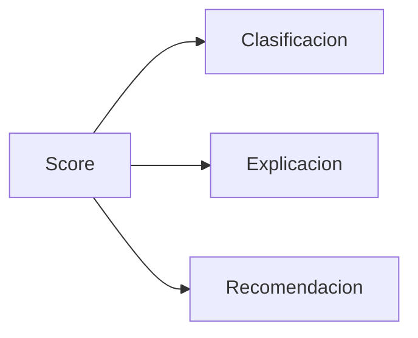

# Motor de Decision

## Objetivo
Transformar el score en clasificacion, explicacion y recomendacion.

## Que hace
| Aspecto | Descripcion |
| --- | --- |
| Entradas | Score total + breakdown |
| Salidas | Clasificacion, explicacion, recomendacion |
| Estado | Pendiente de implementacion |

## Clasificacion
| Rango score | Clase |
| --- | --- |
| > 0.6 | Strong Buy |
| 0.2 a 0.6 | Buy |
| -0.2 a 0.2 | Neutral |
| -0.6 a -0.2 | Sell |
| < -0.6 | Strong Sell |

## Flujo

## Notas / Limitaciones
- Umbrales fijos (no adaptativos).
