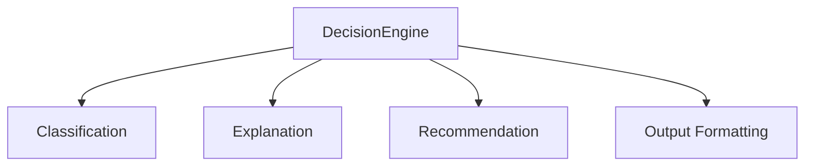

# [DECISION] Módulo de Motor de Decisión

## [UBICACION] Ubicación

`src/final/decision/`

## [OBJETIVO] Objetivo

Este módulo convierte el **score numérico** del sistema de scoring en una **clasificación discreta** y genera **explicaciones legibles** y **recomendaciones de acción** para el usuario final.

El motor de decisión:
- Clasifica el score en categorías discretas
- Genera explicaciones textuales comprensibles
- Proporciona breakdown detallado del score
- Ofrece recomendaciones de acción concretas
- Formatea la salida de manera estándar

---

## [ESTADO] Estado Actual

Módulo en desarrollo inicial. Pendiente de implementación.

---

## [ARQUITECTURA] Arquitectura del Módulo



```
DecisionEngine
├── Classification
│   ├── Threshold-based Classification
│   ├── Confidence Calculation
│   └── Risk Assessment
├── Explanation Generation
│   ├── Score Breakdown Explanation
│   ├── Key Factors Identification
│   └── Contextual Insights
├── Recommendation Generation
│   ├── Action Recommendations
│   ├── Position Sizing Suggestions
│   └── Risk Warnings
└── Output Formatting
    ├── Structured Output
    ├── Human-readable Text
    └── JSON/Dict Format
```

---

## [FUNCIONALIDADES] Funcionalidades Planificadas

### Clasificación Discreta

Convierte el score continuo [-1, +1] en categorías discretas:

#### Categorías

- **Strong Buy**: Score > 0.6
  - Señal muy positiva
  - Alta confianza
  - Oportunidad excepcional

- **Buy**: Score 0.2 - 0.6
  - Señal positiva
  - Confianza moderada-alta
  - Buena oportunidad

- **Neutral**: Score -0.2 - 0.2
  - Señal neutral
  - Baja confianza
  - Esperar o mantener posición

- **Sell**: Score -0.6 - -0.2
  - Señal negativa
  - Confianza moderada-alta
  - Considerar venta

- **Strong Sell**: Score < -0.6
  - Señal muy negativa
  - Alta confianza
  - Evitar o vender urgentemente

#### Cálculo de Confianza

La confianza se calcula basándose en:

- **Magnitud del score**: Scores extremos = mayor confianza
- **Consenso entre señales**: Acuerdo entre estrategias = mayor confianza
- **Calidad de datos**: Datos completos = mayor confianza

```python
confidence = calculate_confidence(
    score_magnitude=abs(total_score),
    signal_consensus=variance_of_signals,
    data_quality=completeness_score
)
```

### Generación de Explicaciones

#### Breakdown del Score

Explica cómo se llegó al score:

```
"Score Total: 0.65 (Buy)

Desglose:
- Análisis Técnico: 0.55 (contribución: 22%)
  - Momentum: 0.75 (fuerte señal alcista)
  - Trend Following: 0.60 (tendencia positiva)
  
- Análisis Fundamental: 0.70 (contribución: 42%)
  - Value: 0.80 (muy subvalorada)
  - Quality: 0.70 (alta calidad)
  - Growth: 0.60 (crecimiento moderado)
```

#### Factores Clave

Identifica los factores más importantes:

```
"Factores Clave Positivos:
1. Valoración atractiva (PE bajo comparado con sector)
2. Alta rentabilidad (ROE superior al promedio)
3. Momentum técnico positivo (RSI y MACD alcistas)

Factores Clave Negativos:
1. Crecimiento moderado (no excepcional)
2. Deuda elevada (aunque manejable)"
```

#### Insights Contextuales

Proporciona contexto adicional:

```
"Contexto:
- El score de 0.65 indica una oportunidad de compra sólida
- La combinación de valoración atractiva y calidad alta es favorable
- El momentum técnico apoya la decisión
- Considerar entrada gradual debido a volatilidad moderada"
```

### Recomendaciones de Acción

#### Recomendaciones Generales

```python
if classification == "Strong Buy":
    recommendation = "Considerar compra significativa"
elif classification == "Buy":
    recommendation = "Considerar compra moderada"
elif classification == "Neutral":
    recommendation = "Mantener posición o esperar"
elif classification == "Sell":
    recommendation = "Considerar reducir posición"
elif classification == "Strong Sell":
    recommendation = "Considerar venta completa"
```

#### Sugerencias de Tamaño de Posición

Basadas en score y confianza:

```python
position_size = calculate_position_size(
    score=total_score,
    confidence=confidence,
    risk_tolerance=user_risk_tolerance
)

# Ejemplo:
# Strong Buy + Alta Confianza = 5-10% del portfolio
# Buy + Moderada Confianza = 2-5% del portfolio
# Neutral = 0% (no añadir)
```

#### Advertencias de Riesgo

Identifica riesgos potenciales:

```python
risk_warnings = identify_risks(
    score_breakdown=breakdown,
    data_quality=data_quality,
    market_conditions=market_conditions
)

# Ejemplo:
# "Advertencia: Score basado parcialmente en datos técnicos
#  que pueden cambiar rápidamente. Monitorear momentum."
```

---

## [USO] Uso Previsto

### Inicialización

```python
from src.final.decision import DecisionEngine

# Con umbrales por defecto
engine = DecisionEngine()

# Con umbrales personalizados
engine = DecisionEngine(
    thresholds={
        'strong_buy': 0.7,
        'buy': 0.3,
        'neutral': 0.0,
        'sell': -0.3,
        'strong_sell': -0.7
    }
)
```

### Generar Decisión

```python
# Score y breakdown del módulo de scoring
score_result = {
    'total_score': 0.65,
    'classification': 'Buy',
    'breakdown': {...},
    'explanation': '...'
}

# Generar decisión completa
decision = engine.make_decision(
    score_result=score_result,
    symbol="AAPL",
    current_price=150.0
)

# Decision contiene:
# - classification: "Buy"
# - confidence: 0.75
# - explanation: Texto completo explicativo
# - recommendation: "Considerar compra moderada"
# - position_suggestion: "2-5% del portfolio"
# - risk_warnings: ["Advertencia: ..."]
# - key_factors: {...}
```

### Obtener Explicación Completa

```python
explanation = decision['explanation']

# Texto completo legible:
"""
RECOMENDACIÓN: BUY
Score: 0.65 | Confianza: 75%

RESUMEN:
Apple Inc. (AAPL) muestra una señal de compra positiva basada en
análisis técnico y fundamental combinados.

DESGLOSE DEL SCORE:
- Análisis Fundamental (70% del score): 0.70
  * Value Investing: 0.80 (muy subvalorada)
  * Quality Investing: 0.70 (alta calidad)
  * Growth Investing: 0.60 (crecimiento moderado)
  
- Análisis Técnico (30% del score): 0.55
  * Momentum: 0.75 (fuerte señal alcista)
  * Trend Following: 0.60 (tendencia positiva)

FACTORES CLAVE:
✓ Valoración atractiva (PE ratio bajo)
✓ Alta rentabilidad (ROE superior)
✓ Momentum técnico positivo

RECOMENDACIÓN:
Considerar compra moderada (2-5% del portfolio). Entrada gradual
recomendada debido a volatilidad moderada del mercado.

ADVERTENCIAS:
- Monitorear momentum técnico (puede cambiar rápidamente)
- Revisar datos fundamentales en próximo reporte trimestral
"""
```

### Formato Estructurado

```python
# Acceder a componentes individuales
classification = decision['classification']
confidence = decision['confidence']
recommendation = decision['recommendation']
key_factors = decision['key_factors']
risk_warnings = decision['risk_warnings']
```

---

## [FORMATO] Formato de Salida

### Estructura Estándar

```python
{
    'symbol': 'AAPL',
    'timestamp': '2024-01-15T10:30:00',
    'classification': 'Buy',
    'score': 0.65,
    'confidence': 0.75,
    'explanation': {
        'summary': '...',
        'breakdown': '...',
        'key_factors': {...},
        'context': '...'
    },
    'recommendation': {
        'action': 'Considerar compra moderada',
        'position_suggestion': '2-5% del portfolio',
        'entry_strategy': 'Entrada gradual recomendada'
    },
    'risk_warnings': [...],
    'metadata': {
        'data_quality': 0.95,
        'signals_used': [...],
        'calculation_timestamp': '...'
    }
}
```

### Formato Legible

También se puede obtener en formato texto plano para mostrar al usuario:

```python
readable_output = engine.format_readable(decision)
print(readable_output)
```

---

## [CONFIGURACION] Configuración Avanzada

### Umbrales Personalizados

```python
engine = DecisionEngine(
    thresholds={
        'strong_buy': 0.8,      # Más estricto
        'buy': 0.4,
        'neutral': 0.0,
        'sell': -0.4,
        'strong_sell': -0.8
    }
)
```

### Perfiles de Usuario

```python
# Perfil conservador
engine = DecisionEngine(profile='conservative')
# Requiere scores más altos para Buy

# Perfil agresivo
engine = DecisionEngine(profile='aggressive')
# Acepta scores más bajos para Buy

# Perfil balanceado
engine = DecisionEngine(profile='balanced')
# Umbrales estándar
```

### Personalización de Explicaciones

```python
engine = DecisionEngine(
    explanation_style='detailed',  # 'brief', 'detailed', 'technical'
    include_breakdown=True,
    include_risks=True,
    language='es'  # 'es', 'en'
)
```

---

## [INTEGRACION] Integración con Otros Módulos

### Entrada

- **Score result**: Del módulo `analisis/scoring`
- **Datos adicionales**: Precio actual, símbolo, etc.
- **Formato**: Dict con score, breakdown, explanation

### Salida

- **Decisión estructurada**: Dict completo con clasificación y explicación
- **Formato legible**: Texto para mostrar al usuario
- **Recomendaciones**: Acciones sugeridas

### Flujo

```
Score Total + Breakdown
    ↓
DecisionEngine
    ↓
Classification + Explanation + Recommendation
    ↓
Visualization Module
```

---

## [VALIDACION] Validación y Testing

### Validación de Clasificación

- Verificación de umbrales correctos
- Validación de rangos de score
- Testing con scores conocidos

### Validación de Explicaciones

- Verificación de coherencia con score
- Validación de factores identificados
- Testing de legibilidad

### Testing

- Testing con diferentes scores
- Validación de recomendaciones
- Verificación de formato de salida

---

## [LIMITACIONES] Limitaciones Conocidas

- **Umbrales fijos**: No se adaptan automáticamente a condiciones de mercado
- **Recomendaciones genéricas**: No consideran situación personal del usuario
- **No considera contexto macro**: Solo análisis de la acción individual
- **Explicaciones predefinidas**: Pueden no cubrir todos los casos edge

---

## [FUTURO] Mejoras Futuras

- **Umbrales adaptativos**: Ajuste automático según volatilidad de mercado
- **Personalización por usuario**: Perfiles y preferencias individuales
- **Análisis de contexto macro**: Incorporar condiciones de mercado
- **Recomendaciones dinámicas**: Ajuste según evolución del score
- **Multi-idioma**: Soporte para múltiples idiomas
- **Explicaciones con IA**: Generación más natural y contextual
- **Integración con portfolio**: Considerar posición actual del usuario
- **Alertas y notificaciones**: Sistema de alertas cuando cambia la recomendación
