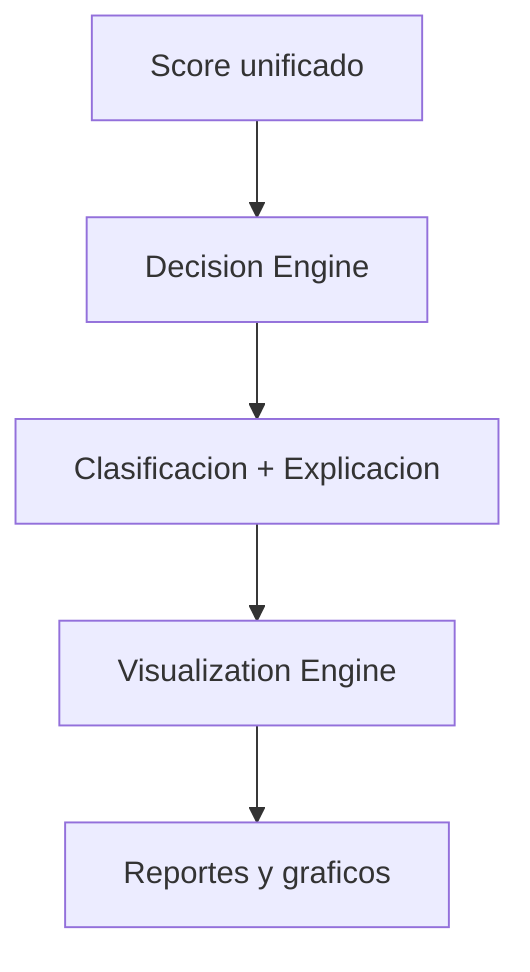

# [FINAL] Módulo Final del Pipeline

## [OBJETIVO] Objetivo

Este módulo convierte el **score numérico** del sistema de scoring en **decisiones accionables** y genera **visualizaciones y reportes ejecutivos** para el usuario final.

El módulo `final` es la última etapa del pipeline y produce la salida consumible por el usuario.

## [ESTRUCTURA] Estructura del Módulo

```
src/final/
├── decision/        Motor de decisión y clasificación
│   └── decision.md   Documentación exhaustiva
└── visualization/   Visualización y reporting
    └── visualization.md   Documentación exhaustiva
```

## [COMPONENTES] Componentes

### Decision (`src/final/decision/`)

Motor de decisión que convierte scores en clasificaciones y explicaciones.

**Funcionalidades**:
- Clasificación discreta basada en umbrales (Strong Buy / Buy / Neutral / Sell / Strong Sell)
- Cálculo de confianza basado en magnitud del score y consenso de señales
- Generación de explicaciones legibles y comprensibles
- Breakdown detallado del score con contribuciones de cada componente
- Identificación de factores clave positivos y negativos
- Recomendaciones de acción concretas (compra, venta, mantener)
- Sugerencias de tamaño de posición basadas en score y confianza
- Advertencias de riesgo identificadas automáticamente

**Ver documentación completa**: `src/final/decision/decision.md`

### Visualization (`src/final/visualization/`)

Motor de visualización y generación de reportes.

**Funcionalidades**:
- **Gráficos de precios**: Candlestick charts con indicadores técnicos overlay
- **Visualización del score**: Breakdown charts, radar charts, waterfall charts
- **Tablas ejecutivas**: Resumen de métricas clave, comparaciones, datos históricos
- **Reportes completos**: PDF y HTML con todos los análisis
- **Dashboards interactivos**: Visualizaciones interactivas con Plotly
- **Estilos profesionales**: Temas light/dark, esquemas de color configurables
- **Exportación múltiple**: PNG, SVG, PDF, HTML, Excel

**Ver documentación completa**: `src/final/visualization/visualization.md`

## [FLUJO] Flujo de Datos



```
Score Unificado + Breakdown (del módulo scoring)
    ↓
Decision Engine
    ↓
Clasificación + Explicación + Recomendación
    ↓
Visualization Engine
    ↓
Gráficos + Tablas + Reportes
    ↓
Usuario Final
```

## [CLASIFICACIONES] Clasificaciones Disponibles

- **Strong Buy**: Score > 0.6 (señal muy positiva, alta confianza)
- **Buy**: Score 0.2 - 0.6 (señal positiva, confianza moderada-alta)
- **Neutral**: Score -0.2 - 0.2 (señal neutral, baja confianza)
- **Sell**: Score -0.6 - -0.2 (señal negativa, confianza moderada-alta)
- **Strong Sell**: Score < -0.6 (señal muy negativa, alta confianza)

## [FORMATOS] Formatos de Salida

### Decision Engine

- **Dict estructurado**: JSON-like con todos los componentes
- **Texto legible**: Explicación completa en formato texto
- **Metadata**: Información sobre calidad de datos y señales usadas

### Visualization Engine

- **Gráficos**: PNG, SVG, PDF, HTML (interactivo)
- **Tablas**: HTML, LaTeX, CSV, Excel
- **Reportes**: PDF completo, HTML interactivo
- **Dashboards**: HTML interactivo con navegación

## [ESTADO] Estado

- ⏳ [PENDIENTE] Motor de decisión (`decision/`)
- ⏳ [PENDIENTE] Visualización avanzada (`visualization/`)

## [DOCUMENTACION] Documentación Detallada

Para información exhaustiva sobre cada componente:

- **Motor de decisión**: Ver `src/final/decision/decision.md`
- **Visualización**: Ver `src/final/visualization/visualization.md`
