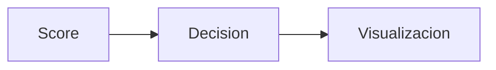

# Modulo Final

## Objetivo
Convertir el score en decision y visualizaciones consumibles.

## Que hace
| Aspecto | Descripcion |
| --- | --- |
| Entradas | Score + breakdown |
| Salidas | Clasificacion, explicacion, reportes |
| Estado | Pendiente de implementacion |

## Componentes clave
- `decision/` clasificacion y recomendaciones
- `visualization/` graficos y reportes

## Flujo

## Referencias
- Decision: `decision/decision.md`
- Visualizacion: `visualization/visualization.md`
