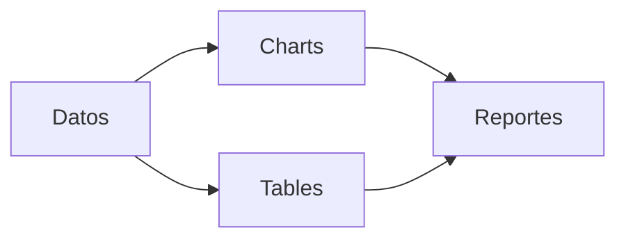

# Visualizacion y Reporting

## Objetivo
Generar graficos, tablas y reportes a partir del score y datos base.

## Que hace
| Aspecto | Descripcion |
| --- | --- |
| Entradas | Precios, fundamentales, decision |
| Salidas | Graficos, tablas, reportes |
| Estado | Pendiente de implementacion |

## Salidas (resumen)
| Tipo | Formatos |
| --- | --- |
| Graficos | PNG, SVG, PDF, HTML |
| Tablas | HTML, CSV, Excel |
| Reportes | PDF, HTML |

## Funciones clave (planificado)
| Funcion | Descripcion |
| --- | --- |
| Charts | Precios, indicadores, score |
| Tables | Resumen y comparativas |
| Reportes | PDF/HTML |

## Flujo

## Notas / Limitaciones
- Reportes grandes pueden ser lentos.
