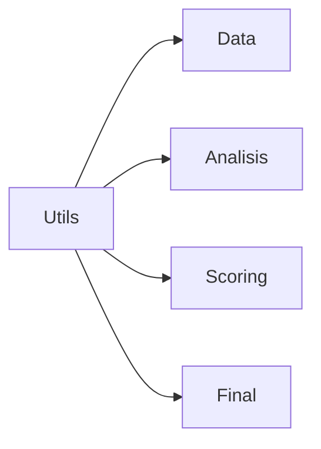

# [UTILS] Módulo de Utilidades

## [UBICACION] Ubicación

`src/utils/`

## [OBJETIVO] Objetivo

Este módulo contiene funciones auxiliares y utilidades compartidas por otros módulos.

## [ESTADO] Estado Actual

Módulo en desarrollo inicial. Pendiente de implementación.

## [PLANIFICADO] Funcionalidades Planificadas

- Funciones de normalización de datos
- Helpers de manejo de fechas
- Validación de datos financieros
- Formateo de números y monedas
- Helpers de logging
- Funciones de conversión de tipos
